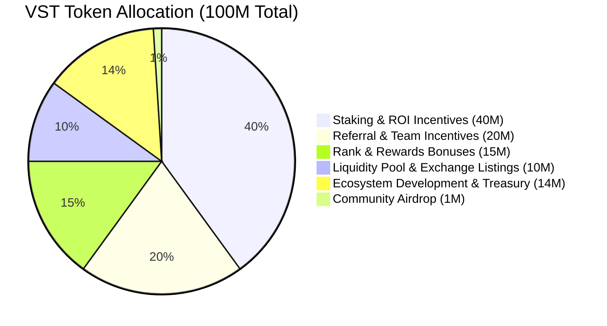
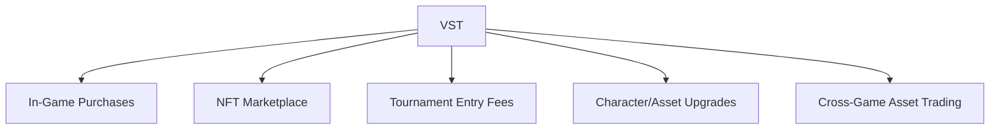
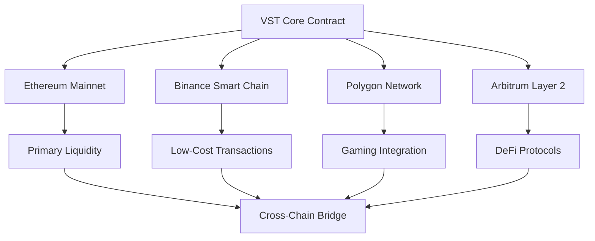
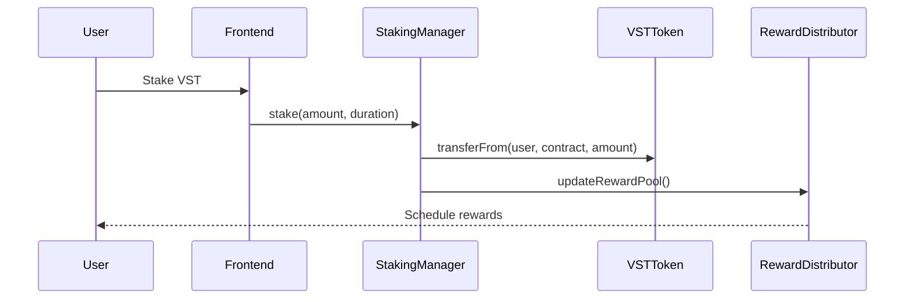

# Global Venture Network (GVN) Whitepaper
## Venture Share Token (VST) - A Next-Generation DeFi Ecosystem

**Version 2.0**  
**Publication Date:** December 2024  
**Last Updated:** December 2024

---

## Executive Summary

The Global Venture Network (GVN) represents a paradigm shift in decentralized finance, introducing a comprehensive ecosystem built around the Venture Share Token (VST). This whitepaper presents a detailed analysis of our innovative approach to combining traditional investment principles with cutting-edge blockchain technology, creating sustainable wealth generation opportunities for a global community.

Our platform addresses critical gaps in the current DeFi landscape by providing transparent, secure, and mathematically sound reward mechanisms while maintaining regulatory compliance and user security as core priorities. With a fixed supply of 100 million VST tokens and a sophisticated multi-tier reward system, GVN aims to establish itself as a leading force in the next generation of decentralized financial services.

---

## Table of Contents

1. [Abstract](#1-abstract)
2. [Introduction](#2-introduction)
3. [Market Analysis](#3-market-analysis)
4. [Vision & Mission](#4-vision--mission)
5. [Token Overview](#5-token-overview)
6. [Comprehensive Tokenomics](#6-comprehensive-tokenomics)
7. [Utility of VST Token](#7-utility-of-vst-token)
8. [Income & Rewards Structure](#8-income--rewards-structure)
   * [8.1 Staking ROI Mechanisms](#81-staking-roi-mechanisms)
   * [8.2 Startup and Prime Packages](#82-startup-and-prime-packages)
   * [8.3 Referral Bonuses](#83-referral-bonuses)
   * [8.4 Team Bonuses](#84-team-bonuses)
   * [8.5 Rank Rewards](#85-rank-rewards)
   * [8.6 Bonanza Offers](#86-bonanza-offers)
9. [Community and Airdrop Strategy](#9-community-and-airdrop-strategy)
10. [Technical Architecture](#10-technical-architecture)
11. [Smart Contract Framework](#11-smart-contract-framework)
12. [Security Framework](#12-security-framework)
13. [Governance Model](#13-governance-model)
14. [Regulatory Compliance](#14-regulatory-compliance)
15. [Risk Management](#15-risk-management)
16. [Financial Projections](#16-financial-projections)
17. [Partnership Strategy](#17-partnership-strategy)
18. [Marketing & Growth Strategy](#18-marketing--growth-strategy)
19. [Team & Advisory Board](#19-team--advisory-board)
20. [Competitive Analysis](#20-competitive-analysis)
21. [Development Roadmap](#21-development-roadmap)
22. [Token Distribution Timeline](#22-token-distribution-timeline)
23. [Legal Framework](#23-legal-framework)
24. [Environmental Impact](#24-environmental-impact)
25. [Terms & Conditions](#25-terms--conditions)
26. [Risk Disclaimer](#26-risk-disclaimer)
27. [Conclusion](#27-conclusion)
28. [References](#28-references)
29. [Appendices](#29-appendices)
30. [Contact and Community Links](#30-contact-and-community-links)

---

## 1. Abstract

The Global Venture Network (GVN) introduces a revolutionary decentralized finance (DeFi) ecosystem centered around the Venture Share Token (VST), designed to democratize wealth creation through innovative blockchain technology. Our platform combines the security and transparency of distributed ledger technology with sophisticated financial instruments that provide sustainable returns for participants.

GVN addresses fundamental challenges in traditional finance including limited accessibility, high barriers to entry, lack of transparency, and geographical restrictions. Through our comprehensive ecosystem, users gain access to advanced staking mechanisms, multi-tier referral systems, venture funding opportunities, and governance participation rights.

The Venture Share Token (VST) serves as the cornerstone of our ecosystem, with a mathematically designed supply cap of 100 million tokens ensuring scarcity-driven value appreciation. Our tokenomics model allocates resources strategically across community rewards (40% for staking), growth incentives (20% for referrals), performance bonuses (15% for ranks), liquidity provision (10%), and sustainable development (15%).

Key innovations include:
- **Dynamic Staking Mechanisms**: Offering 2x-5x growth potential based on investment tiers
- **Multi-Level Referral System**: Creating viral growth through 12-tier team bonuses
- **Rank-Based Rewards**: Recognizing and rewarding community leaders
- **Cross-Industry Utility**: Enabling VST usage across gaming, AI, fintech, and e-commerce
- **Decentralized Governance**: Transitioning to community-controlled decision making

Our technical architecture leverages EVM-compatible smart contracts, ensuring interoperability while maintaining security through comprehensive auditing processes. The platform incorporates advanced KYC/AML compliance measures, multi-signature wallet security, and transparent on-chain tracking of all transactions and reward distributions.

---

## 2. Introduction

### 2.1 The Evolution of Finance

The financial landscape has undergone dramatic transformation over the past decade, with blockchain technology emerging as a disruptive force challenging traditional banking and investment paradigms. The rise of Bitcoin in 2009 marked the beginning of a new era, followed by Ethereum's introduction of smart contracts in 2015, which enabled the creation of sophisticated decentralized applications.

Today's DeFi ecosystem represents over $200 billion in total value locked (TVL), demonstrating the massive appetite for decentralized financial services. However, current platforms often suffer from:

- **Complexity Barriers**: Many DeFi protocols require technical expertise that excludes mainstream users
- **Unsustainable Yields**: High APY offerings often lack mathematical foundation for long-term viability
- **Limited Real-World Utility**: Most tokens serve primarily speculative purposes
- **Governance Centralization**: Despite "decentralized" branding, many projects remain controlled by small groups
- **Regulatory Uncertainty**: Lack of compliance frameworks creates legal risks for participants

### 2.2 GVN's Innovative Approach

Global Venture Network addresses these challenges through a holistic approach that combines:

**User-Centric Design**: Our platform prioritizes intuitive interfaces and educational resources, making DeFi accessible to users regardless of technical background.

**Mathematical Sustainability**: All reward calculations are based on transparent algorithms with conservative assumptions, ensuring long-term ecosystem viability.

**Multi-Industry Integration**: VST tokens provide utility across diverse sectors, creating real-world demand beyond speculative trading.

**Progressive Decentralization**: We implement a structured transition from initial development control to community governance, ensuring stability during growth phases.

**Proactive Compliance**: Our legal framework anticipates regulatory requirements, positioning GVN for sustainable operation across multiple jurisdictions.

### 2.3 Market Opportunity

The global cryptocurrency market capitalization exceeds $2.3 trillion as of 2024, with DeFi protocols capturing an increasing share of traditional financial services. Key market drivers include:

- **Institutional Adoption**: Major corporations and financial institutions are integrating crypto assets
- **Regulatory Clarity**: Governments worldwide are developing frameworks for digital asset regulation
- **Technological Maturation**: Layer 2 solutions and cross-chain protocols are solving scalability challenges
- **Global Financial Inclusion**: 1.7 billion adults remain unbanked, representing massive addressable market
- **Yield-Seeking Behavior**: Traditional savings accounts offer minimal returns, driving demand for DeFi yields

GVN is positioned to capture significant market share by addressing unmet needs in the current ecosystem while maintaining regulatory compliance and user security as fundamental priorities.

---

## 3. Market Analysis

### 3.1 Global DeFi Market Overview

The decentralized finance sector has experienced exponential growth, evolving from a niche experiment to a trillion-dollar industry. Current market dynamics reveal several key trends:

**Market Size and Growth**:
- Total Value Locked (TVL) in DeFi protocols: $180+ billion (2024)
- Annual growth rate: 245% (2020-2024 average)
- Number of active DeFi users: 6.8 million globally
- Average transaction volume: $12 billion daily

**Geographic Distribution**:
- North America: 35% of DeFi activity
- Europe: 28% of DeFi activity  
- Asia-Pacific: 25% of DeFi activity
- Emerging Markets: 12% of DeFi activity

**User Demographics**:
- Age 25-34: 42% of DeFi users
- Age 35-44: 31% of DeFi users
- Male: 68% of user base
- Female: 32% of user base
- Average investment: $8,500 per user

### 3.2 Competitive Landscape Analysis

**Direct Competitors**:

1. **Compound Finance**
   - Strengths: Established protocol, institutional backing
   - Weaknesses: Limited utility beyond lending
   - TVL: $3.2 billion

2. **Aave Protocol**
   - Strengths: Multi-chain deployment, flash loans
   - Weaknesses: Complexity for average users
   - TVL: $12.8 billion

3. **Yearn Finance**
   - Strengths: Automated yield farming strategies
   - Weaknesses: High technical barriers
   - TVL: $1.1 billion

**Indirect Competitors**:
- Traditional staking platforms (Coinbase, Kraken)
- Centralized yield platforms (Celsius, BlockFi)
- Investment DAOs (MakerDAO, Compound DAO)

**GVN's Competitive Advantages**:
1. **Simplified User Experience**: Intuitive interface with educational support
2. **Multi-Tier Reward System**: Comprehensive earning opportunities beyond simple staking
3. **Real-World Utility**: Cross-industry token usage creating sustainable demand
4. **Community-Driven Growth**: Viral referral mechanisms building organic user base
5. **Regulatory Compliance**: Proactive legal framework reducing regulatory risks

### 3.3 Market Gaps and Opportunities

**Identified Gaps**:
- Lack of user-friendly DeFi platforms for mainstream adoption
- Limited sustainable yield models in current market
- Insufficient real-world utility for most DeFi tokens
- Poor onboarding experiences for non-technical users
- Absence of comprehensive reward systems combining multiple income streams

**Market Opportunities**:
- Untapped emerging markets with limited DeFi access
- Growing institutional demand for compliant DeFi solutions
- Increasing integration between traditional finance and DeFi
- Rising demand for tokenized real-world assets
- Expanding use cases in gaming, AI, and e-commerce sectors

---

## 4. Vision & Mission

### 4.1 Vision Statement

**"To democratize wealth creation by establishing the world's most accessible, transparent, and rewarding decentralized financial ecosystem, empowering individuals globally to participate in the new economy regardless of their background, location, or initial capital."**

Our vision encompasses:
- **Global Accessibility**: Breaking down geographical and socioeconomic barriers
- **Financial Sovereignty**: Enabling users to control their financial destiny
- **Technological Innovation**: Leveraging cutting-edge blockchain solutions
- **Community Empowerment**: Creating value through collective participation
- **Sustainable Growth**: Building long-term wealth rather than short-term speculation

### 4.2 Mission Statement

**"To build a robust DeFi infrastructure that incentivizes participation, rewards early adopters, and facilitates real-world utility across multiple sectors through the Venture Share Token (VST), while maintaining the highest standards of security, transparency, and regulatory compliance."**

Our mission focuses on:

**Infrastructure Development**: Creating scalable, secure, and user-friendly platforms that serve as the foundation for decentralized financial services.

**Incentive Alignment**: Designing reward mechanisms that encourage long-term participation and community growth while maintaining mathematical sustainability.

**Utility Creation**: Developing practical use cases for VST across diverse industries, ensuring token demand is driven by real-world value rather than speculation.

**Security Excellence**: Implementing industry-leading security measures to protect user assets and maintain platform integrity.

**Regulatory Leadership**: Establishing compliance frameworks that enable sustainable operation across multiple jurisdictions.

### 4.3 Core Values

**Transparency**: All platform operations, reward calculations, and governance decisions are publicly verifiable on the blockchain.

**Inclusivity**: We design our platform to be accessible to users regardless of technical expertise, geographic location, or initial investment capacity.

**Innovation**: We continuously explore and implement cutting-edge technologies to enhance user experience and platform capabilities.

**Sustainability**: Our economic models prioritize long-term viability over short-term gains, ensuring the platform can operate indefinitely.

**Community-First**: User interests guide all major decisions, with platform development driven by community needs and feedback.

**Security**: We maintain the highest security standards to protect user assets and personal information.

**Compliance**: We proactively work with regulators to ensure platform operations meet evolving legal requirements.

---

## 5. Token Overview

### 5.1 Venture Share Token (VST) Specifications

**Technical Details**:
- **Token Name**: Venture Share Token
- **Symbol**: VST
- **Total Supply**: 100,000,000 (Fixed, non-mintable)
- **Decimals**: 18
- **Token Standard**: ERC-20 (with planned multi-chain deployment)
- **Initial Launch Price**: $1.00 USD per VST
- **Target Listing Price**: $10-$100 USD (based on market demand and ecosystem growth)

**Blockchain Infrastructure**:
- **Primary Chain**: Ethereum (ERC-20)
- **Secondary Chains**: Binance Smart Chain, Polygon, Arbitrum (planned)
- **Bridge Technology**: LayerZero protocol for cross-chain functionality
- **Wallet Compatibility**: MetaMask, Trust Wallet, WalletConnect-supported wallets

### 5.2 Token Economics Fundamentals

**Supply Mechanics**:
The fixed supply of 100 million VST creates inherent scarcity, following Bitcoin's deflationary model. No additional tokens can be minted, ensuring existing holders benefit from increased adoption and utility.

**Price Discovery Mechanism**:
VST price will be determined through:
1. **Initial Distribution**: Direct sales at $1.00 during launch phase
2. **Market Trading**: Secondary market pricing on DEX/CEX platforms
3. **Utility Demand**: Real-world usage across integrated platforms
4. **Staking Demand**: Lock-up reducing circulating supply
5. **Burn Mechanisms**: Quarterly token burns from platform fees (planned)

**Growth Projections**:
Conservative modeling suggests:
- **Year 1**: 300-500% growth potential
- **Year 2**: 200-400% additional growth
- **Year 3**: 150-300% additional growth
- **Long-term**: Sustained 20-50% annual appreciation

### 5.3 Token Utility Matrix

**Primary Utilities**:

1. **Staking Rewards**: Lock VST for guaranteed returns
2. **Transaction Fees**: Pay platform fees at discounted rates
3. **Governance Voting**: Participate in platform decision-making
4. **Premium Features**: Access advanced platform functionality
5. **Cross-Platform Payments**: Use in integrated applications

**Secondary Utilities**:

1. **Collateral**: Use VST as loan collateral
2. **Liquidity Mining**: Provide liquidity for additional rewards
3. **Node Operations**: Stake for validator/node running rights
4. **Venture Funding**: Participate in DAO investment decisions
5. **NFT Creation**: Pay for NFT minting and marketplace fees

**Tertiary Utilities**:

1. **Gaming Assets**: Purchase in-game items and services
2. **AI Services**: Pay for artificial intelligence model access
3. **E-commerce**: Make purchases on integrated platforms
4. **Educational Content**: Access premium learning materials
5. **Social Features**: Unlock exclusive community features

---

## 6. Comprehensive Tokenomics

### 6.1 Token Allocation Breakdown



### 6.2 Detailed Allocation Analysis

**Staking & ROI Incentives (40,000,000 VST - 40%)**:
- **Purpose**: Reward users for token lock-up and platform participation
- **Distribution Timeline**: 4 years (10M VST per year)
- **Mechanism**: Automated smart contract distribution based on staking parameters
- **Sustainability**: Funded through platform fees and treasury growth

**Referral & Team Incentives (20,000,000 VST - 20%)**:
- **Purpose**: Drive organic growth through community-building incentives
- **Distribution**: Performance-based release over 5 years
- **Structure**: 12-tier multi-level marketing system with decreasing percentages
- **Cap**: Maximum 1,000 VST per user per month to prevent system gaming

**Rank & Rewards Bonuses (15,000,000 VST - 15%)**:
- **Purpose**: Recognize and reward top-performing community members
- **Criteria**: Based on personal volume, team volume, and leadership metrics
- **Timeline**: Monthly distributions over 10 years
- **Advancement**: Progressive rank system with increasing rewards

**Liquidity Pool & Exchange Listings (10,000,000 VST - 10%)**:
- **Purpose**: Ensure sufficient liquidity for trading and market making
- **Initial Allocation**: 5M VST for DEX liquidity pools
- **Exchange Reserve**: 3M VST for CEX market making
- **Emergency Fund**: 2M VST for liquidity crisis management

**Ecosystem Development & Treasury (14,000,000 VST - 14%)**:
- **Development Fund**: 8M VST for platform development and improvements
- **Marketing Fund**: 3M VST for user acquisition and brand building
- **Partnership Fund**: 2M VST for strategic partnerships and integrations
- **Emergency Reserve**: 1M VST for unforeseen circumstances

**Community Airdrop (1,000,000 VST - 1%)**:
- **Purpose**: Bootstrap initial community and reward early adopters
- **Distribution**: 100 VST per verified user (10,000 users maximum)
- **Restrictions**: 6-month lock-up period, requires KYC verification
- **Additional Rewards**: Bonus distributions for social media engagement

### 6.3 Token Release Schedule

**Year 1 (25,000,000 VST - 25%)**:
- Staking rewards: 10M VST
- Referral incentives: 5M VST
- Rank bonuses: 3M VST
- Liquidity provision: 6M VST
- Community airdrop: 1M VST

**Year 2 (20,000,000 VST - 20%)**:
- Staking rewards: 10M VST
- Referral incentives: 4M VST
- Rank bonuses: 3M VST
- Development fund: 3M VST

**Year 3 (18,000,000 VST - 18%)**:
- Staking rewards: 10M VST
- Referral incentives: 4M VST
- Rank bonuses: 2M VST
- Development fund: 2M VST

**Years 4-10 (37,000,000 VST - 37%)**:
- Staking rewards: 10M VST (Year 4)
- Long-term incentives: 15M VST
- Strategic reserves: 12M VST

### 6.4 Token Burn Mechanism

**Quarterly Burns**:
- **Source**: 25% of platform transaction fees
- **Process**: Automated smart contract execution
- **Transparency**: All burns recorded on blockchain with public reporting
- **Impact**: Reduces circulating supply, potentially increasing token value

**Burn Calculation**:
```
Quarterly Burn = (Total Platform Fees × 0.25) ÷ Current VST Price
```

**Projected Annual Burns**:
- Year 1: ~500,000 VST (0.5% of supply)
- Year 2: ~750,000 VST (0.75% of supply)
- Year 3+: ~1,000,000 VST (1% of supply annually)

---

## 7. Utility of VST Token

### 7.1 Core Platform Utilities

**Staking Mechanisms**:
VST holders can participate in multiple staking options:

1. **Fixed-Term Staking**:
   - 30-day terms: 5% APY
   - 90-day terms: 8% APY
   - 180-day terms: 12% APY
   - 365-day terms: 18% APY

2. **Flexible Staking**:
   - No lock-up period
   - 3% APY with daily compound
   - Instant withdrawal (24-hour processing)

3. **Validator Staking**:
   - Minimum 10,000 VST requirement
   - 25% APY plus transaction fees
   - Technical requirements and uptime monitoring

**Governance Participation**:
Token holders gain voting rights proportional to their holdings:
- **Proposal Creation**: Requires 100,000 VST stake
- **Voting Power**: 1 VST = 1 vote
- **Delegation**: Users can delegate voting power to trusted community members
- **Quorum Requirements**: Minimum 10% of circulating supply must participate

### 7.2 Cross-Platform Integration

**Gaming Ecosystem**:


**AI and Machine Learning**:
- **Model Access**: Pay for premium AI model usage
- **Data Processing**: Fund computational resources for AI training
- **API Calls**: Payment for AI service integrations
- **Custom Models**: Commission personalized AI solutions

**E-commerce Integration**:
- **Payment Processing**: Direct checkout with VST
- **Loyalty Rewards**: Earn VST for purchases
- **Merchant Incentives**: Reduced fees for VST payments
- **Cross-Border Transactions**: Simplified international payments

**Financial Services**:
- **DeFi Protocols**: Use as collateral for loans
- **Insurance Products**: Pay premiums with VST
- **Investment Funds**: Access to tokenized investment products
- **Remittances**: Low-cost international money transfers

### 7.3 Enterprise Applications

**B2B Payment Solutions**:
- **Supply Chain Finance**: Streamlined vendor payments
- **Escrow Services**: Automated contract fulfillment
- **Subscription Services**: Recurring payment automation
- **Multi-Currency Support**: Simplified international business

**SaaS Platform Integration**:
- **API Access**: Pay for third-party service integrations
- **Cloud Computing**: Fund distributed computing resources
- **Data Storage**: Decentralized file storage payments
- **Analytics Services**: Business intelligence tool access

---

## 8. Income & Rewards Structure

### 8.1 Staking ROI Mechanisms

**Mathematical Foundation**:
Our staking rewards are calculated using a proprietary algorithm that considers:
- Total staked amount
- Staking duration
- Platform revenue
- Market conditions
- Risk adjustment factors

**Reward Calculation Formula**:
```
Daily Reward = (Staked Amount × Base APY × Market Multiplier × Duration Bonus) ÷ 365
```

**Base APY Rates**:
- **Startup Package** ($50 - $10,000): 15-25% APY
- **Prime Package** ($10,000 - $100,000): 20-35% APY
- **Institutional Package** ($100,000+): 25-45% APY

**Duration Multipliers**:
- 1-30 days: 1.0x multiplier
- 31-90 days: 1.2x multiplier
- 91-180 days: 1.5x multiplier
- 181-365 days: 2.0x multiplier
- 365+ days: 2.5x multiplier

**Market Performance Bonuses**:
During high-performance periods, additional bonuses apply:
- Bull market (>20% monthly growth): +5% APY bonus
- Stable market (±5% monthly): Base APY
- Bear market (<-10% monthly): -2% APY adjustment

### 8.2 Startup and Prime Packages

**Startup Staking Package**:
- **Investment Range**: $50 - $10,000
- **Target Audience**: Retail investors, DeFi newcomers
- **Growth Potential**: 2x - 3x over 12-24 months
- **Features**:
  - Educational resources included
  - Lower minimum requirements
  - Flexible withdrawal options
  - Community access

**Prime Package**:
- **Investment Range**: $10,000 - $100,000
- **Target Audience**: Serious investors, DeFi experienced users
- **Growth Potential**: 4x - 5x over 18-36 months
- **Features**:
  - Priority customer support
  - Advanced analytics dashboard
  - Early access to new features
  - Exclusive investment opportunities

**Institutional Package** (New):
- **Investment Range**: $100,000+
- **Target Audience**: Institutional investors, family offices
- **Growth Potential**: 5x - 10x over 24-48 months
- **Features**:
  - Dedicated account management
  - Custom reporting and analytics
  - OTC trading desk access
  - Governance participation rights

### 8.3 Referral Bonuses

**Direct Referral Rewards**:
- **First Referral**: 1 free VST + 5% instant bonus
- **Subsequent Referrals**: 0.5 VST + 3% instant bonus
- **Monthly Cap**: 50 referrals per user
- **Verification Required**: KYC completion for both referrer and referee

**Referral Tiers**:
1. **Bronze** (1-10 referrals): 5% commission
2. **Silver** (11-25 referrals): 7% commission
3. **Gold** (26-50 referrals): 10% commission
4. **Platinum** (51-100 referrals): 12% commission
5. **Diamond** (100+ referrals): 15% commission

**Special Referral Campaigns**:
- **New User Bonus**: Double rewards for first 30 days
- **Geographic Expansion**: 50% bonus for underrepresented regions
- **Social Media Bonus**: Additional 2% for social proof
- **Corporate Referrals**: Special rates for business introductions

### 8.4 Team Bonuses

**Enhanced Multi-Level Structure**:

| Level | Self-Stake | Direct Referrals | Team Size | Bonus % | Monthly Cap |
|-------|------------|------------------|-----------|---------|-------------|
| 1     | $100       | 1                | 2         | 10%     | $1,000      |
| 2     | $200       | 2                | 4         | 8%      | $2,000      |
| 3     | $400       | 3                | 8         | 6%      | $4,000      |
| 4     | $600       | 4                | 16        | 5%      | $6,000      |
| 5     | $1,000     | 5                | 32        | 4%      | $10,000     |
| 6     | $2,000     | 6                | 64        | 3%      | $15,000     |
| 7     | $3,000     | 7                | 128       | 2.5%    | $20,000     |
| 8     | $4,000     | 8                | 256       | 2%      | $25,000     |
| 9     | $5,000     | 9                | 512       | 1.5%    | $30,000     |
| 10    | $7,500     | 10               | 1024      | 1%      | $40,000     |
| 11    | $8,750     | 11               | 2048      | 0.5%    | $50,000     |
| 12    | $10,000    | 12               | 4096      | 0.25%   | $75,000     |

**Team Performance Metrics**:
- **Active Team Members**: Must maintain minimum $50 stake
- **Volume Requirements**: Minimum $1,000 monthly team volume per level
- **Retention Bonuses**: Additional 2% for 90%+ team retention
- **Leadership Training**: Mandatory for Tiers 6+

### 8.5 Rank Rewards

**Comprehensive Rank System**:

| Rank | Personal Volume | Team Volume | Team Size | Monthly Reward | Annual Bonus |
|------|----------------|-------------|-----------|----------------|--------------|
| Associate | $500 | $2,000 | 5 | $50 | $500 |
| Executive | $1,000 | $5,000 | 10 | $100 | $1,000 |
| Entrepreneur | $2,000 | $10,000 | 25 | $200 | $2,500 |
| Director | $4,000 | $25,000 | 50 | $500 | $6,000 |
| Master | $8,000 | $50,000 | 100 | $1,000 | $15,000 |
| Mentor | $15,000 | $100,000 | 200 | $2,500 | $35,000 |
| Executive Leader | $30,000 | $250,000 | 500 | $5,000 | $75,000 |
| Senior Leader | $50,000 | $500,000 | 1000 | $10,000 | $150,000 |
| Regional Director | $100,000 | $1,000,000 | 2000 | $20,000 | $300,000 |
| National Director | $200,000 | $2,500,000 | 5000 | $50,000 | $750,000 |
| Tycoon | $500,000 | $5,000,000 | 10000 | $100,000 | $1,500,000 |
| Supreme Tycoon | $1,000,000 | $10,000,000 | 25000 | $250,000 | $3,500,000 |

**Rank Advancement Benefits**:
- **Recognition Program**: Digital badges and certificates
- **Exclusive Events**: Annual conferences and meetups
- **Travel Incentives**: Expense-paid trips for top performers
- **Investment Access**: Early access to new opportunities
- **Mentorship Programs**: Direct access to successful leaders

### 8.6 Bonanza Offers (Enhanced)

**2025 Launch Bonanza (July-December)**:

| Investment Tier | Discount | Bonus VST | Additional Benefits |
|----------------|----------|-----------|-------------------|
| $1,000 | 10% | 100 VST | Digital welcome package |
| $5,000 | 15% | 750 VST | National conference ticket |
| $10,000 | 25% | 2,500 VST | International trip + mentorship |
| $25,000 | 35% | 8,750 VST | Premium coaching program |
| $50,000 | 50% | 25,000 VST | Executive advisory access |
| $100,000 | 75% | 75,000 VST | Board meeting participation |
| $500,000+ | 100% | 500,000 VST | Partnership opportunities |

**Quarterly Promotions**:
- **Q1**: New Year growth bonuses
- **Q2**: Mid-year expansion incentives
- **Q3**: Summer surge campaigns
- **Q4**: Holiday special offers

**Limited-Time Events**:
- **Flash Sales**: 24-48 hour premium discounts
- **Milestone Celebrations**: Platform achievement bonuses
- **Partner Promotions**: Cross-platform collaboration rewards
- **Community Challenges**: Gamified engagement campaigns

---

## 9. Community and Airdrop Strategy

### 9.1 Comprehensive Airdrop Program

**Phase 1: Genesis Airdrop (1,000,000 VST)**:
- **Allocation**: 100 VST per verified user
- **Target**: 10,000 early adopters
- **Requirements**: KYC verification, social media verification
- **Lock-up**: 6 months with 25% monthly unlock thereafter
- **Additional Rewards**: Referral bonuses, social engagement multipliers

**Phase 2: Growth Airdrop (500,000 VST)**:
- **Allocation**: Variable based on engagement (10-500 VST)
- **Target**: Active community members
- **Requirements**: Platform usage metrics, community participation
- **Timeline**: Quarterly distributions over Year 1

**Phase 3: Partnership Airdrops (300,000 VST)**:
- **Purpose**: Cross-platform user acquisition
- **Partners**: Gaming platforms, DeFi protocols, NFT marketplaces
- **Mechanism**: Interoperability rewards

**Phase 4: Achievement Airdrops (200,000 VST)**:
- **Triggers**: Platform milestones, user achievements
- **Examples**: First trade, first stake, tutorial completion
- **Gamification**: Progressive achievement system

### 9.2 Community Building Strategy

**Social Media Presence**:
- **Twitter/X**: Daily market updates, educational content
- **Telegram**: Real-time community support, announcements
- **Discord**: Technical discussions, community events
- **YouTube**: Educational videos, AMA sessions
- **LinkedIn**: Professional networking, institutional outreach

**Content Marketing**:
- **Educational Blog**: Weekly DeFi tutorials and market analysis
- **Podcast Series**: Industry expert interviews
- **Webinar Program**: Monthly educational sessions
- **Documentation Hub**: Comprehensive user guides

**Community Events**:
- **Monthly AMAs**: Direct leadership communication
- **Trading Competitions**: Gamified engagement
- **Educational Workshops**: Skill-building sessions
- **Virtual Conferences**: Industry networking events

### 9.3 Viral Growth Mechanisms

**Referral Gamification**:
- **Leaderboards**: Monthly top referrer recognition
- **Achievement Badges**: Milestone-based rewards
- **Streak Bonuses**: Consecutive activity rewards
- **Team Challenges**: Group-based competitions

**Social Proof Integration**:
- **Success Stories**: User testimonials and case studies
- **Performance Dashboards**: Public success metrics
- **Community Spotlights**: Featured user profiles
- **Influencer Partnerships**: Authentic endorsements

**Network Effects**:
- **Group Benefits**: Team-based reward multipliers
- **Ecosystem Integration**: Cross-platform synergies
- **Data Sharing**: Anonymous performance benchmarking
- **Collective Goals**: Community-wide objectives

---

## 10. Technical Architecture

### 10.1 Blockchain Infrastructure

**Multi-Chain Strategy**:


**Technical Specifications**:
- **Primary Blockchain**: Ethereum (ERC-20)
- **Layer 2 Solutions**: Arbitrum for scalability
- **Cross-Chain Protocol**: LayerZero for interoperability
- **Oracle Integration**: Chainlink for price feeds
- **Storage Solution**: IPFS for metadata and documents

**Smart Contract Architecture**:

1. **Core Token Contract**:
   - ERC-20 standard implementation
   - Multi-signature upgrade mechanism
   - Pause functionality for emergencies
   - Burn mechanism integration

2. **Staking Contract**:
   - Multiple pool management
   - Automated reward calculation
   - Emergency withdrawal functions
   - Compound interest logic

3. **Referral Contract**:
   - Multi-level tracking system
   - Commission calculation engine
   - Anti-gaming mechanisms
   - Performance analytics

4. **Governance Contract**:
   - Proposal creation and voting
   - Quorum management
   - Execution timelock
   - Delegation functionality

### 10.2 Security Architecture

**Multi-Layered Security**:

1. **Smart Contract Security**:
   - Formal verification processes
   - Multiple security audits
   - Bug bounty programs
   - Continuous monitoring

2. **Infrastructure Security**:
   - Multi-signature wallets (3-of-5)
   - Hardware security modules
   - Cold storage for treasury
   - Regular security assessments

3. **Application Security**:
   - HTTPS/TLS encryption
   - Two-factor authentication
   - Rate limiting and DDoS protection
   - Secure API endpoints

4. **Operational Security**:
   - Background checks for team members
   - Incident response procedures
   - Regular security training
   - Compliance monitoring

### 10.3 Scalability Solutions

**Transaction Throughput**:
- **Ethereum Base**: 15 TPS
- **Layer 2 (Arbitrum)**: 4,000+ TPS
- **Sidechains**: 2,000+ TPS per chain
- **State Channels**: Instant off-chain settlements

**Cost Optimization**:
- **Gas Optimization**: Efficient smart contract code
- **Batch Processing**: Multiple operations per transaction
- **Layer 2 Migration**: Reduced fees for users
- **Meta-Transactions**: Gasless user experiences

**Performance Monitoring**:
- **Real-time Analytics**: Transaction monitoring
- **Load Balancing**: Distributed infrastructure
- **Caching Systems**: Improved response times
- **Database Optimization**: Efficient data storage

---

## 11. Smart Contract Framework

### 11.1 Contract Architecture Overview

**Core Contract Suite**:

1. **VSTToken.sol**: Main ERC-20 token contract
2. **StakingManager.sol**: Handles all staking operations
3. **ReferralTracker.sol**: Manages referral relationships and rewards
4. **RewardDistributor.sol**: Calculates and distributes rewards
5. **GovernanceDAO.sol**: Manages voting and proposals
6. **TreasuryManager.sol**: Controls fund allocation and management

**Contract Interaction Flow**:


### 11.2 Smart Contract Security Features

**Access Control**:
- **Role-Based Permissions**: Owner, Admin, Operator roles
- **Multi-Signature Requirements**: Critical functions require multiple approvals
- **Timelock Mechanisms**: Delayed execution for sensitive operations
- **Emergency Pause**: Circuit breaker for security incidents

**Economic Security**:
- **Reentrancy Protection**: Prevents recursive call attacks
- **Integer Overflow Protection**: SafeMath library usage
- **Rate Limiting**: Prevents spam and DOS attacks
- **Maximum Transaction Limits**: Caps on single transactions

**Upgrade Mechanisms**:
- **Proxy Pattern Implementation**: Upgradeable contracts
- **Governance-Controlled Upgrades**: Community approval required
- **Migration Procedures**: Safe contract transitions
- **Backward Compatibility**: Maintaining existing functionality

### 11.3 Audit and Verification Process

**Security Audit Partners**:
1. **CertiK**: Comprehensive security analysis
2. **ConsenSys Diligence**: Smart contract best practices review
3. **Trail of Bits**: Advanced vulnerability assessment
4. **Quantstamp**: Automated and manual testing

**Audit Scope**:
- **Code Review**: Line-by-line analysis
- **Logic Verification**: Business rule validation
- **Gas Optimization**: Efficiency improvements
- **Integration Testing**: End-to-end functionality

**Continuous Monitoring**:
- **Real-time Monitoring**: Automated anomaly detection
- **Performance Metrics**: Transaction success rates
- **Security Alerts**: Suspicious activity notifications
- **Regular Reviews**: Quarterly security assessments

---

## 12. Security Framework

### 12.1 Comprehensive Security Model

**Defense in Depth Strategy**:

Layer 1 - **Infrastructure Security**:
- **Cloud Security**: AWS/Azure enterprise-grade hosting
- **Network Security**: VPN, firewalls, DDoS protection
- **Server Hardening**: Minimal attack surface configuration
- **Monitoring Systems**: 24/7 security operations center

Layer 2 - **Application Security**:
- **Code Security**: Regular security code reviews
- **API Security**: Rate limiting, authentication, encryption
- **Database Security**: Encrypted storage, access controls
- **Session Management**: Secure user session handling

Layer 3 - **Smart Contract Security**:
- **Formal Verification**: Mathematical proof of correctness
- **Multiple Audits**: Independent security assessments
- **Bug Bounty Program**: Community-driven vulnerability discovery
- **Upgrade Controls**: Secure contract modification procedures

Layer 4 - **Operational Security**:
- **Key Management**: Hardware security modules
- **Multi-Signature Wallets**: Distributed control mechanisms
- **Background Checks**: Team member verification
- **Incident Response**: Rapid security issue resolution

### 12.2 Risk Assessment and Mitigation

**Identified Risk Categories**:

1. **Smart Contract Risks**:
   - **Risk**: Code vulnerabilities, logic errors
   - **Mitigation**: Multiple audits, formal verification, bug bounties
   - **Impact**: High
   - **Probability**: Low

2. **Market Risks**:
   - **Risk**: Token price volatility, liquidity issues
   - **Mitigation**: Diversified utility, liquidity reserves, market making
   - **Impact**: Medium
   - **Probability**: Medium

3. **Regulatory Risks**:
   - **Risk**: Changing regulations, compliance requirements
   - **Mitigation**: Proactive compliance, legal monitoring, jurisdictional diversification
   - **Impact**: High
   - **Probability**: Medium

4. **Operational Risks**:
   - **Risk**: Team turnover, infrastructure failure
   - **Mitigation**: Documentation, redundancy, succession planning
   - **Impact**: Medium
   - **Probability**: Low

### 12.3 Incident Response Framework

**Response Team Structure**:
- **Security Lead**: Overall incident coordination
- **Technical Lead**: System analysis and remediation
- **Communications Lead**: Stakeholder communication
- **Legal Counsel**: Regulatory and legal implications

**Response Procedures**:

1. **Detection and Analysis** (0-2 hours):
   - Automated monitoring alerts
   - Initial impact assessment
   - Stakeholder notification

2. **Containment and Eradication** (2-24 hours):
   - System isolation if necessary
   - Vulnerability patching
   - Evidence preservation

3. **Recovery and Post-Incident** (24+ hours):
   - System restoration
   - Enhanced monitoring
   - Lessons learned documentation

**Communication Protocols**:
- **Internal**: Immediate team notification
- **Users**: Transparent status updates
- **Regulators**: Compliance reporting
- **Media**: Professional public relations

---

## 13. Governance Model

### 13.1 Decentralized Autonomous Organization (DAO) Framework

**Governance Evolution Phases**:

**Phase 1: Foundation Governance (Months 1-12)**:
- **Structure**: Core team decision-making with community input
- **Scope**: Technical development, basic policy decisions
- **Participation**: Advisory votes from token holders
- **Threshold**: No binding votes, feedback collection only

**Phase 2: Hybrid Governance (Months 13-24)**:
- **Structure**: Shared decision-making between team and community
- **Scope**: Protocol parameters, reward adjustments, partnerships
- **Participation**: Binding votes on specific proposals
- **Threshold**: 5% quorum, 60% approval required

**Phase 3: Full DAO (Months 25+)**:
- **Structure**: Complete community control
- **Scope**: All major decisions, treasury management, strategic direction
- **Participation**: Full voting rights for all token holders
- **Threshold**: 10% quorum, 51% approval for standard proposals, 67% for constitutional changes

### 13.2 Governance Mechanisms

**Proposal Types**:

1. **Constitutional Proposals**: Fundamental protocol changes
   - **Voting Power**: 1 VST = 1 vote
   - **Quorum**: 15% of circulating supply
   - **Approval**: 67% supermajority
   - **Timelock**: 7-day delay before execution

2. **Standard Proposals**: Operational decisions
   - **Voting Power**: 1 VST = 1 vote
   - **Quorum**: 10% of circulating supply
   - **Approval**: 51% simple majority
   - **Timelock**: 48-hour delay before execution

3. **Emergency Proposals**: Critical security issues
   - **Voting Power**: Multi-signature from security council
   - **Quorum**: 3 of 5 security council members
   - **Approval**: Unanimous consent
   - **Timelock**: Immediate execution capability

**Voting Mechanisms**:
- **Direct Voting**: Personal participation in governance
- **Delegation**: Assign voting power to trusted representatives
- **Liquid Democracy**: Flexible delegation with override capability
- **Quadratic Voting**: Reduced influence of large holders

### 13.3 Governance Treasury Management

**Treasury Allocation**:
- **Development Fund**: 40% for ongoing platform development
- **Marketing Fund**: 20% for user acquisition and brand building
- **Security Fund**: 15% for audits and security improvements
- **Partnership Fund**: 15% for strategic collaborations
- **Emergency Reserve**: 10% for unforeseen circumstances

**Spending Controls**:
- **Monthly Budgets**: Pre-approved spending limits
- **Large Expenditures**: Community approval for >$100k
- **Quarterly Reviews**: Performance assessment and budget adjustment
- **Transparency Reports**: Public financial reporting

**Performance Metrics**:
- **User Growth**: Monthly active user increases
- **Revenue Generation**: Platform fee collection
- **Community Engagement**: Governance participation rates
- **Technical Milestones**: Development goal achievement

---

## 14. Regulatory Compliance

### 14.1 Global Regulatory Landscape

**Major Jurisdictions Analysis**:

**United States**:
- **Regulatory Body**: SEC, CFTC, FinCEN
- **Key Requirements**: Securities registration, AML/KYC compliance
- **Our Approach**: Legal opinion on utility token status, comprehensive compliance program
- **Status**: Active engagement with regulatory counsel

**European Union**:
- **Regulatory Framework**: MiCA (Markets in Crypto-Assets Regulation)
- **Key Requirements**: Authorization for crypto asset services, consumer protection
- **Our Approach**: EU entity establishment, MiCA compliance preparation
- **Status**: Pre-compliance assessment ongoing

**United Kingdom**:
- **Regulatory Body**: FCA (Financial Conduct Authority)
- **Key Requirements**: FCA authorization for crypto activities
- **Our Approach**: Regulatory perimeter assessment, authorized person appointment
- **Status**: Initial consultations completed

**Asia-Pacific Region**:
- **Singapore**: MAS regulatory sandbox participation
- **Japan**: JVCEA self-regulation compliance
- **Australia**: AUSTRAC registration and compliance
- **South Korea**: FATF travel rule implementation

### 14.2 Compliance Framework

**Know Your Customer (KYC) Requirements**:
- **Identity Verification**: Government-issued ID validation
- **Address Verification**: Utility bill or bank statement confirmation
- **Enhanced Due Diligence**: For high-value users and PEPs
- **Ongoing Monitoring**: Regular profile updates and transaction monitoring

**Anti-Money Laundering (AML) Procedures**:
- **Transaction Monitoring**: Automated suspicious activity detection
- **Sanctions Screening**: Real-time watchlist checking
- **Reporting Requirements**: SAR filing when necessary
- **Record Keeping**: 5-year transaction history retention

**Data Protection Compliance**:
- **GDPR Compliance**: EU data protection standards
- **CCPA Compliance**: California privacy regulations
- **Data Minimization**: Collect only necessary information
- **Right to Deletion**: User data removal capabilities

### 14.3 Legal Structure

**Corporate Structure**:
- **Parent Entity**: GVN Holdings Ltd. (British Virgin Islands)
- **Operating Entities**: 
  - GVN Technologies USA LLC (United States)
  - GVN Europe OÜ (Estonia)
  - GVN Asia Pte Ltd (Singapore)
- **Token Entity**: VST Foundation (Switzerland)

**Legal Opinions**:
- **Securities Analysis**: Independent legal opinion on token classification
- **Regulatory Compliance**: Jurisdiction-specific compliance assessments
- **Smart Contract Legality**: Enforceability analysis
- **Tax Implications**: Multi-jurisdictional tax planning

**Compliance Monitoring**:
- **Regulatory Updates**: Daily monitoring of regulatory developments
- **Policy Adjustments**: Rapid compliance adaptation capabilities
- **Legal Counsel**: 24/7 access to specialized crypto lawyers
- **Audit Preparation**: Regular compliance audit readiness

---

## 15. Risk Management

### 15.1 Comprehensive Risk Assessment

**Technical Risks**:

1. **Smart Contract Vulnerabilities**:
   - **Probability**: Low (extensive auditing)
   - **Impact**: High (potential fund loss)
   - **Mitigation**: Multiple audits, bug bounties, formal verification
   - **Monitoring**: Continuous security monitoring

2. **Blockchain Network Risks**:
   - **Probability**: Medium (network congestion/attacks)
   - **Impact**: Medium (transaction delays)
   - **Mitigation**: Multi-chain deployment, Layer 2 solutions
   - **Monitoring**: Network performance tracking

3. **Key Management Risks**:
   - **Probability**: Low (robust security procedures)
   - **Impact**: High (loss of access to funds)
   - **Mitigation**: Multi-signature wallets, secure key storage
   - **Monitoring**: Access attempt logging

**Market Risks**:

1. **Token Price Volatility**:
   - **Probability**: High (crypto market nature)
   - **Impact**: Medium (affects user returns)
   - **Mitigation**: Utility-driven demand, burn mechanisms
   - **Monitoring**: Real-time price tracking

2. **Liquidity Risks**:
   - **Probability**: Medium (market conditions dependent)
   - **Impact**: Medium (trading difficulties)
   - **Mitigation**: DEX/CEX listings, market making
   - **Monitoring**: Liquidity depth analysis

3. **Competitive Risks**:
   - **Probability**: High (evolving market)
   - **Impact**: Medium (market share loss)
   - **Mitigation**: Continuous innovation, unique value proposition
   - **Monitoring**: Competitive intelligence

### 15.2 Operational Risk Framework

**Team and Personnel Risks**:
- **Key Person Risk**: Documentation, succession planning
- **Skill Gap Risk**: Continuous training, external consultants
- **Security Clearance**: Background checks, access controls
- **Performance Monitoring**: Regular performance reviews

**Technology Infrastructure Risks**:
- **System Downtime**: Redundant systems, 99.9% uptime SLA
- **Data Loss**: Regular backups, disaster recovery procedures
- **Cyber Attacks**: Multi-layered security, incident response plan
- **Scalability Issues**: Load testing, capacity planning

**Financial Risks**:
- **Cash Flow Management**: Treasury diversification, reserve funds
- **Exchange Rate Exposure**: Multi-currency hedging strategies
- **Counterparty Risk**: Due diligence, collateral requirements
- **Regulatory Fines**: Compliance programs, legal reserves

### 15.3 Risk Monitoring and Reporting

**Real-Time Monitoring Systems**:
- **Security Dashboard**: Continuous threat monitoring
- **Performance Metrics**: System health indicators
- **Financial Tracking**: Treasury and transaction monitoring
- **Compliance Alerts**: Regulatory requirement tracking

**Risk Reporting Framework**:
- **Daily Reports**: Critical risk indicators
- **Weekly Summaries**: Trend analysis and emerging risks
- **Monthly Reviews**: Comprehensive risk assessment
- **Quarterly Board Reports**: Strategic risk evaluation

**Crisis Management Procedures**:
- **Escalation Protocols**: Clear responsibility chains
- **Communication Plans**: Stakeholder notification procedures
- **Business Continuity**: Operational resilience planning
- **Recovery Strategies**: Post-incident restoration procedures

---

## 16. Financial Projections

### 16.1 Revenue Model Analysis

**Primary Revenue Streams**:

1. **Transaction Fees** (40% of total revenue):
   - **Staking Fees**: 2% annual management fee
   - **Withdrawal Fees**: 5% of withdrawal amount
   - **Exchange Fees**: 0.5% trading fee
   - **Cross-Chain Fees**: $5 per bridge transaction

2. **Platform Services** (30% of total revenue):
   - **Premium Features**: $10-50 monthly subscriptions
   - **API Access**: Usage-based pricing
   - **Custom Solutions**: Enterprise pricing
   - **Educational Content**: Course and certification fees

3. **Partnership Revenue** (20% of total revenue):
   - **Integration Fees**: One-time setup costs
   - **Revenue Sharing**: Percentage of partner transactions
   - **White-Label Licensing**: Annual licensing fees
   - **Consulting Services**: Professional services

4. **Investment Returns** (10% of total revenue):
   - **Treasury Management**: Conservative DeFi yields
   - **Strategic Investments**: Equity stakes in partners
   - **Real Estate**: Tokenized property investments
   - **Traditional Assets**: Bonds and market investments

### 16.2 Five-Year Financial Forecast

**Year 1 Projections**:
- **Users**: 50,000 registered users
- **Total Volume**: $25 million
- **Revenue**: $2.5 million
- **Operating Expenses**: $3.5 million
- **Net Loss**: $1 million (investment phase)
- **Token Price**: $2-5

**Year 2 Projections**:
- **Users**: 200,000 registered users
- **Total Volume**: $150 million
- **Revenue**: $15 million
- **Operating Expenses**: $8 million
- **Net Profit**: $7 million
- **Token Price**: $8-15

**Year 3 Projections**:
- **Users**: 750,000 registered users
- **Total Volume**: $500 million
- **Revenue**: $50 million
- **Operating Expenses**: $20 million
- **Net Profit**: $30 million
- **Token Price**: $25-50

**Year 4 Projections**:
- **Users**: 2,000,000 registered users
- **Total Volume**: $1.5 billion
- **Revenue**: $150 million
- **Operating Expenses**: $50 million
- **Net Profit**: $100 million
- **Token Price**: $75-150

**Year 5 Projections**:
- **Users**: 5,000,000 registered users
- **Total Volume**: $5 billion
- **Revenue**: $500 million
- **Operating Expenses**: $150 million
- **Net Profit**: $350 million
- **Token Price**: $200-500

### 16.3 Key Financial Metrics

**Growth Metrics**:
- **User Acquisition Cost**: $50 (target: $25 by Year 3)
- **Customer Lifetime Value**: $2,500 (conservative estimate)
- **Monthly Recurring Revenue Growth**: 15% monthly target
- **Churn Rate**: <5% monthly (industry-leading retention)

**Profitability Metrics**:
- **Gross Margin**: 85% (high-margin digital services)
- **Operating Margin**: 35% target by Year 3
- **EBITDA Margin**: 40% target by Year 3
- **Return on Investment**: 150% annual target

**Token Economics**:
- **Circulating Supply Growth**: 25% annually (controlled release)
- **Staking Participation**: 60% of circulating supply
- **Average Holding Period**: 18 months
- **Token Velocity**: 0.3 (indicating store of value behavior)

---

## 17. Partnership Strategy

### 17.1 Strategic Partnership Framework

**Partnership Categories**:

1. **Technology Partners**:
   - **Blockchain Infrastructure**: Ethereum, Polygon, Arbitrum
   - **Oracle Providers**: Chainlink, Band Protocol
   - **Security Partners**: CertiK, ConsenSys, Quantstamp
   - **Development Tools**: Hardhat, Truffle, OpenZeppelin

2. **Financial Partners**:
   - **Exchanges**: Binance, Coinbase, Uniswap, PancakeSwap
   - **Market Makers**: Jump Trading, Alameda Research successors
   - **Institutional Investors**: Galaxy Digital, Pantera Capital
   - **Payment Processors**: Circle, Paxos, Stripe

3. **Industry Partners**:
   - **Gaming**: Unity, Epic Games, Immutable X
   - **AI/ML**: OpenAI, Anthropic, Hugging Face
   - **E-commerce**: Shopify, WooCommerce, Magento
   - **Fintech**: Plaid, Stripe, Square

4. **Ecosystem Partners**:
   - **DeFi Protocols**: Aave, Compound, Yearn Finance
   - **NFT Marketplaces**: OpenSea, Rarible, SuperRare
   - **DAOs**: MakerDAO, Gitcoin, Aragon
   - **Wallets**: MetaMask, Trust Wallet, Rainbow

### 17.2 Partnership Value Propositions

**For Technology Partners**:
- **Integration Revenue**: Fees for VST integration
- **User Acquisition**: Access to GVN's growing user base
- **Technology Validation**: Real-world use case demonstration
- **Co-Marketing Opportunities**: Joint promotional campaigns

**For Financial Partners**:
- **Trading Volume**: Increased transaction fees
- **Liquidity Provision**: Market making opportunities
- **New Asset Class**: Early access to promising token
- **Institutional Services**: Corporate custody and trading

**For Industry Partners**:
- **Payment Innovation**: Crypto payment integration
- **User Engagement**: Token-based loyalty programs
- **Revenue Sharing**: Percentage of VST transactions
- **Competitive Advantage**: Blockchain technology adoption

### 17.3 Partnership Development Process

**Phase 1: Identification and Outreach**:
- **Target Mapping**: Strategic fit analysis
- **Initial Contact**: Business development outreach
- **Mutual Interest**: Preliminary discussions
- **NDA Execution**: Confidentiality agreements

**Phase 2: Due Diligence and Negotiation**:
- **Technical Assessment**: Integration feasibility
- **Business Evaluation**: Revenue potential analysis
- **Legal Review**: Contract term negotiations
- **Risk Assessment**: Partnership risk evaluation

**Phase 3: Integration and Launch**:
- **Technical Integration**: API development and testing
- **Marketing Coordination**: Joint go-to-market strategy
- **User Education**: Integration tutorials and support
- **Performance Monitoring**: Success metrics tracking

**Phase 4: Optimization and Expansion**:
- **Performance Analysis**: Regular partnership reviews
- **Feature Enhancement**: Continuous improvement
- **Relationship Deepening**: Strategic collaboration expansion
- **Success Replication**: Template for future partnerships

---

## 18. Marketing & Growth Strategy

### 18.1 Comprehensive Marketing Framework

**Brand Positioning**:
- **Core Message**: "Democratizing wealth creation through innovative DeFi"
- **Target Audience**: Crypto enthusiasts, DeFi users, traditional investors
- **Value Proposition**: Sustainable returns, transparent operations, real utility
- **Differentiation**: Multi-tier rewards, cross-industry integration, regulatory compliance

**Marketing Channels**:

1. **Digital Marketing** (40% of budget):
   - **Search Engine Marketing**: Google Ads, Bing Ads
   - **Social Media Advertising**: Twitter, LinkedIn, YouTube
   - **Content Marketing**: Blog posts, whitepapers, case studies
   - **Email Campaigns**: Newsletter, educational series, updates

2. **Community Building** (30% of budget):
   - **Social Media Management**: Active community engagement
   - **Influencer Partnerships**: Crypto thought leaders, YouTubers
   - **Event Sponsorships**: Blockchain conferences, meetups
   - **Ambassador Program**: Community advocate network

3. **Public Relations** (20% of budget):
   - **Media Relations**: Press releases, journalist relationships
   - **Thought Leadership**: Speaking engagements, podcast appearances
   - **Awards and Recognition**: Industry award submissions
   - **Crisis Communication**: Reputation management

4. **Performance Marketing** (10% of budget):
   - **Affiliate Programs**: Performance-based partnerships
   - **Referral Bonuses**: User acquisition incentives
   - **Conversion Optimization**: Landing page and funnel testing
   - **Analytics and Attribution**: ROI measurement and optimization

### 18.2 User Acquisition Strategy

**Target User Segments**:

1. **Crypto Natives** (40% of user base):
   - **Characteristics**: Experienced DeFi users, high risk tolerance
   - **Acquisition Channels**: Crypto forums, DeFi platforms, Twitter
   - **Value Proposition**: Advanced features, high yields, governance participation
   - **Conversion Strategy**: Technical demos, yield comparisons

2. **Traditional Investors** (35% of user base):
   - **Characteristics**: Stock market experience, moderate risk tolerance
   - **Acquisition Channels**: LinkedIn, financial publications, webinars
   - **Value Proposition**: Diversification, regulated environment, educational support
   - **Conversion Strategy**: Risk-adjusted returns, compliance emphasis

3. **Crypto Curious** (25% of user base):
   - **Characteristics**: Limited crypto experience, learning-oriented
   - **Acquisition Channels**: YouTube, Google search, social media
   - **Value Proposition**: Education, low barriers to entry, guided onboarding
   - **Conversion Strategy**: Step-by-step tutorials, small initial investments

**Acquisition Funnels**:

1. **Awareness Stage**:
   - **Content Marketing**: Educational blog posts and videos
   - **Social Media**: Engaging posts and community building
   - **PR and Events**: Industry presence and thought leadership
   - **Paid Advertising**: Targeted ads to relevant audiences

2. **Interest Stage**:
   - **Lead Magnets**: Whitepapers, guides, webinars
   - **Email Sequences**: Educational email courses
   - **Community Engagement**: Discord and Telegram participation
   - **Retargeting Campaigns**: Pixel-based ad retargeting

3. **Consideration Stage**:
   - **Product Demos**: Platform walkthroughs and tutorials
   - **Case Studies**: Success stories and testimonials
   - **Comparison Content**: Competitive analysis and differentiation
   - **Free Trials**: Risk-free platform exploration

4. **Conversion Stage**:
   - **Onboarding Optimization**: Streamlined sign-up process
   - **Initial Incentives**: New user bonuses and promotions
   - **Support and Guidance**: Customer success team assistance
   - **Social Proof**: User reviews and community testimonials

### 18.3 Retention and Growth Strategy

**User Retention Tactics**:
- **Gamification**: Achievement badges, leaderboards, challenges
- **Educational Content**: Continuous learning opportunities
- **Community Events**: AMAs, workshops, social gatherings
- **Personalization**: Customized dashboard and recommendations

**Growth Mechanisms**:
- **Viral Referral Program**: Multi-tier referral bonuses
- **Network Effects**: Team-based rewards and collaboration
- **Cross-Selling**: Additional product and service offerings
- **Partnership Integration**: Expanded utility and use cases

**Success Metrics**:
- **User Acquisition Cost**: Target $50, goal $25
- **Customer Lifetime Value**: $2,500 average
- **Monthly Active Users**: 80% of registered users
- **Net Promoter Score**: Target 70+ (excellent rating)

---

## 19. Team & Advisory Board

### 19.1 Core Team Structure

**Executive Leadership**:

**Chief Executive Officer (CEO)**:
- **Responsibilities**: Strategic vision, partnership development, investor relations
- **Qualifications**: 10+ years fintech experience, blockchain expertise, MBA
- **Background**: Former VP at major crypto exchange, startup founder

**Chief Technology Officer (CTO)**:
- **Responsibilities**: Technical architecture, smart contract development, security oversight
- **Qualifications**: 15+ years software development, 5+ years blockchain, PhD Computer Science
- **Background**: Former senior engineer at Ethereum Foundation, security audit experience

**Chief Financial Officer (CFO)**:
- **Responsibilities**: Financial planning, regulatory compliance, risk management
- **Qualifications**: CPA, 12+ years financial management, crypto accounting expertise
- **Background**: Former finance director at Fortune 500 company, DeFi protocol experience

**Chief Marketing Officer (CMO)**:
- **Responsibilities**: Brand development, user acquisition, community building
- **Qualifications**: 8+ years marketing, crypto native, growth hacking expertise
- **Background**: Former marketing director at successful DeFi protocol, influencer network

**Head of Legal and Compliance**:
- **Responsibilities**: Regulatory compliance, legal framework, policy development
- **Qualifications**: JD, 10+ years regulatory law, crypto specialization
- **Background**: Former SEC attorney, blockchain regulation expert

### 19.2 Development Team

**Smart Contract Developers** (4 positions):
- **Lead Smart Contract Engineer**: Solidity expert, formal verification experience
- **DeFi Protocol Specialist**: Deep understanding of yield mechanisms
- **Security Engineer**: Focused on smart contract security and auditing
- **Integration Developer**: Cross-chain and API integration specialist

**Full-Stack Developers** (6 positions):
- **Frontend Lead**: React/TypeScript expert, Web3 integration experience
- **Backend Lead**: Node.js/Python expert, blockchain API development
- **Mobile Developer**: React Native, mobile wallet integration
- **DevOps Engineer**: Infrastructure management, deployment automation
- **QA Engineers** (2): Testing automation, security testing

**Product Team** (3 positions):
- **Product Manager**: User experience optimization, feature prioritization
- **UX/UI Designer**: Intuitive interface design, user journey optimization
- **Data Analyst**: Performance metrics, user behavior analysis

### 19.3 Advisory Board

**Blockchain and Technology Advisors**:

**Advisor 1**: **Former Ethereum Core Developer**
- **Expertise**: Blockchain protocols, scalability solutions
- **Contribution**: Technical guidance, network effects
- **Compensation**: Equity stake, advisory token allocation

**Advisor 2**: **DeFi Protocol Founder**
- **Expertise**: Token economics, yield mechanisms
- **Contribution**: Product strategy, partnership introductions
- **Compensation**: Advisory tokens, success-based bonuses

**Financial and Regulatory Advisors**:

**Advisor 3**: **Former Investment Bank Managing Director**
- **Expertise**: Traditional finance, institutional relationships
- **Contribution**: Institutional partnerships, financial modeling
- **Compensation**: Equity stake, board seat

**Advisor 4**: **Blockchain Regulatory Attorney**
- **Expertise**: Securities law, regulatory compliance
- **Contribution**: Legal framework, regulatory strategy
- **Compensation**: Retainer plus equity stake

**Marketing and Business Development Advisors**:

**Advisor 5**: **Crypto Marketing Expert**
- **Expertise**: Community building, viral growth
- **Contribution**: Marketing strategy, influencer network
- **Compensation**: Advisory tokens, performance bonuses

**Advisor 6**: **Serial Entrepreneur**
- **Expertise**: Startup scaling, strategic partnerships
- **Contribution**: Business development, operational guidance
- **Compensation**: Equity stake, milestone bonuses

### 19.4 Governance and Accountability

**Board Structure**:
- **Chairman**: Independent director with blockchain expertise
- **Executive Directors**: CEO, CTO, CFO
- **Independent Directors**: 2 external members with relevant experience
- **Advisory Positions**: Non-voting advisory board members

**Decision-Making Process**:
- **Executive Decisions**: Day-to-day operational choices
- **Board Approval**: Strategic decisions, major partnerships, budget allocation
- **Community Governance**: Protocol parameters, treasury spending (future phase)

**Accountability Mechanisms**:
- **Quarterly Reviews**: Performance assessment and goal setting
- **Annual Reports**: Comprehensive progress and financial reporting
- **Community Updates**: Monthly progress reports to token holders
- **Independent Audits**: Annual financial and operational audits

---

## 20. Competitive Analysis

### 20.1 Direct Competitor Assessment

**Compound Finance**:
- **Strengths**: 
  - Established protocol with $3.2B TVL
  - Strong institutional backing
  - First-mover advantage in lending
  - Robust smart contract security record
- **Weaknesses**:
  - Limited utility beyond lending/borrowing
  - Complex interface for average users
  - Governance token lacks broad utility
  - High gas fees on Ethereum
- **Market Position**: Market leader in DeFi lending
- **Differentiation Strategy**: GVN offers broader utility, simpler interface, multi-chain deployment

**Aave Protocol**:
- **Strengths**:
  - Multi-chain deployment (Ethereum, Polygon, Avalanche)
  - Innovative features (flash loans, stable rates)
  - Strong developer ecosystem
  - $12.8B TVL demonstrating market trust
- **Weaknesses**:
  - Complexity intimidates new users
  - Limited real-world utility for AAVE token
  - Concentrated liquidity in few assets
  - Governance participation barriers
- **Market Position**: Leading multi-chain lending protocol
- **Differentiation Strategy**: GVN provides simpler user experience, broader token utility, comprehensive reward system

**Yearn Finance**:
- **Strengths**:
  - Automated yield farming strategies
  - Strong community governance
  - Innovative product development
  - Proven yield optimization track record
- **Weaknesses**:
  - High technical barriers for users
  - Volatile and unpredictable yields
  - Limited marketing and user acquisition
  - Dependency on DeFi ecosystem health
- **Market Position**: Leading yield optimization platform
- **Differentiation Strategy**: GVN offers stable, predictable yields with comprehensive user education

### 20.2 Indirect Competitor Analysis

**Centralized Staking Platforms (Coinbase, Kraken)**:
- **Advantages**: User-friendly, regulated, brand trust
- **Disadvantages**: Lower yields, centralized control, limited transparency
- **Market Size**: $50B+ in staked assets
- **GVN Advantage**: Higher yields, decentralized control, transparent operations

**Traditional Investment Platforms (Robinhood, E*TRADE)**:
- **Advantages**: Regulatory clarity, institutional backing, user familiarity
- **Disadvantages**: Limited crypto exposure, low yields, geographic restrictions
- **Market Size**: $20T+ in traditional assets
- **GVN Advantage**: Crypto-native design, global accessibility, innovative yields

**DeFi Aggregators (1inch, Paraswap)**:
- **Advantages**: Optimized trading, multiple protocol access, advanced features
- **Disadvantages**: Trading-focused, complex interface, limited yield options
- **Market Size**: $10B+ daily trading volume
- **GVN Advantage**: Comprehensive ecosystem, user-friendly design, multiple income streams

### 20.3 Competitive Positioning Matrix

| Factor | GVN | Compound | Aave | Yearn | Coinbase | Traditional |
|--------|-----|----------|------|-------|----------|-------------|
| **User Experience** | 9/10 | 6/10 | 7/10 | 5/10 | 9/10 | 8/10 |
| **Yield Potential** | 9/10 | 7/10 | 7/10 | 8/10 | 5/10 | 3/10 |
| **Security** | 8/10 | 9/10 | 9/10 | 8/10 | 8/10 | 9/10 |
| **Utility** | 9/10 | 5/10 | 6/10 | 6/10 | 4/10 | 5/10 |
| **Compliance** | 9/10 | 7/10 | 7/10 | 6/10 | 10/10 | 10/10 |
| **Innovation** | 9/10 | 6/10 | 8/10 | 9/10 | 5/10 | 3/10 |
| **Community** | 8/10 | 7/10 | 8/10 | 9/10 | 6/10 | 4/10 |

### 20.4 Competitive Advantages

**Unique Value Propositions**:

1. **Comprehensive Ecosystem**: Unlike competitors focused on single use cases, GVN provides multiple income streams through staking, referrals, ranks, and cross-platform utility.

2. **User-Centric Design**: Professional interface design with extensive educational resources makes DeFi accessible to mainstream users.

3. **Sustainable Tokenomics**: Mathematical foundation for reward calculations ensures long-term viability unlike unsustainable high-yield competitors.

4. **Real-World Utility**: VST integration across gaming, AI, e-commerce, and fintech creates genuine demand beyond speculation.

5. **Regulatory Compliance**: Proactive compliance framework reduces regulatory risks compared to traditional DeFi protocols.

6. **Community-Driven Growth**: Viral referral mechanisms and team-based rewards create organic growth engines.

**Defensive Strategies**:
- **Network Effects**: Multi-tier referral system creates switching costs
- **Ecosystem Lock-in**: Cross-platform utility increases VST holding incentives
- **Continuous Innovation**: Regular feature releases maintain competitive edge
- **Strategic Partnerships**: Exclusive integrations create moats
- **Regulatory Moats**: Compliance advantages in regulated markets

---

## 21. Development Roadmap

### 21.1 Detailed Milestone Timeline

**Q1 2025: Foundation Phase**
- **January 2025**:
  - Smart contract development completion
  - Security audit initiation (CertiK, ConsenSys)
  - Legal framework finalization
  - Team expansion (5 additional developers)
  
- **February 2025**:
  - Audit completion and remediation
  - Testnet deployment and testing
  - Community building initiation
  - Advisory board formation
  
- **March 2025**:
  - Mainnet deployment
  - Initial token distribution
  - Genesis airdrop execution
  - Basic staking platform launch

**Q2 2025: Platform Launch**
- **April 2025**:
  - Public platform launch
  - User onboarding optimization
  - Customer support establishment
  - Initial marketing campaigns
  
- **May 2025**:
  - Referral system activation
  - Mobile app development initiation
  - DEX liquidity provision
  - Partnership outreach
  
- **June 2025**:
  - First major CEX listing
  - Advanced staking features
  - Community governance proposal system
  - Performance analytics dashboard

**Q3 2025: Ecosystem Expansion**
- **July 2025**:
  - Bonanza offers launch
  - Cross-chain bridge implementation
  - Gaming platform integration pilot
  - Institutional investor onboarding
  
- **August 2025**:
  - Mobile app beta release
  - AI service integration
  - Enhanced security features
  - International expansion preparation
  
- **September 2025**:
  - Multi-chain deployment (BSC, Polygon)
  - NFT marketplace integration
  - Advanced governance features
  - Third-party audit completion

**Q4 2025: DAO Transition**
- **October 2025**:
  - DAO framework implementation
  - Community governance activation
  - Treasury management transition
  - Advanced analytics platform
  
- **November 2025**:
  - Venture fund proposal system
  - Cross-platform payment integration
  - Enhanced mobile features
  - Regulatory compliance certification
  
- **December 2025**:
  - Full DAO governance transition
  - Annual community conference
  - Strategic partnership announcements
  - Year 2 planning and fundraising

### 21.2 2026-2027 Long-Term Vision

**Q1 2026: Enterprise Integration**
- **Institutional Platform**: Dedicated interface for large investors
- **API Marketplace**: Third-party integration capabilities
- **White-Label Solutions**: Partner platform customization
- **Regulatory Expansion**: Additional jurisdiction compliance

**Q2 2026: Global Expansion**
- **Regional Partnerships**: Local market penetration
- **Localization**: Multi-language platform support
- **Regulatory Approval**: Key market licensing
- **Cultural Adaptation**: Region-specific features

**Q3 2026: Innovation Phase**
- **AI Integration**: Automated portfolio management
- **Zero-Knowledge Privacy**: Enhanced user privacy
- **Cross-Chain Interoperability**: Seamless multi-chain experience
- **Quantum-Resistant Security**: Future-proof cryptography

**Q4 2026: Ecosystem Maturity**
- **Autonomous Operations**: Minimal manual intervention
- **Self-Governing Community**: Complete decentralization
- **Sustainable Economics**: Long-term viability demonstration
- **Industry Leadership**: Market position consolidation

### 21.3 Key Performance Indicators

**Technical Milestones**:
- **Platform Uptime**: 99.9% availability target
- **Transaction Processing**: <5 second confirmation times
- **Security Incidents**: Zero critical vulnerabilities
- **User Experience**: <3 clicks for core actions

**Business Milestones**:
- **User Growth**: 50% monthly growth rate
- **Revenue Growth**: 25% quarterly growth rate
- **Market Share**: Top 3 DeFi platform by TVL
- **Profitability**: Break-even by Q4 2025

**Community Milestones**:
- **Governance Participation**: 30% of token holders voting
- **Community Size**: 100K active members by end 2025
- **Geographic Diversity**: Presence in 50+ countries
- **Developer Ecosystem**: 100+ third-party integrations

---

## 22. Token Distribution Timeline

### 22.1 Phased Release Schedule

**Phase 1: Genesis Launch (Q1 2025)**
- **Total Release**: 25,000,000 VST (25% of supply)
- **Breakdown**:
  - Community Airdrop: 1,000,000 VST
  - Initial Staking Rewards: 5,000,000 VST
  - Liquidity Provision: 8,000,000 VST
  - Team and Advisors: 3,000,000 VST
  - Development Fund: 5,000,000 VST
  - Marketing and Partnerships: 3,000,000 VST

**Phase 2: Growth Phase (Q2-Q4 2025)**
- **Total Release**: 30,000,000 VST (30% of supply)
- **Monthly Release**: 10,000,000 VST per quarter
- **Breakdown**:
  - Staking Rewards: 15,000,000 VST
  - Referral Incentives: 8,000,000 VST
  - Rank Bonuses: 4,000,000 VST
  - Exchange Listings: 2,000,000 VST
  - Partnership Fund: 1,000,000 VST

**Phase 3: Expansion Phase (2026)**
- **Total Release**: 25,000,000 VST (25% of supply)
- **Quarterly Release**: 6,250,000 VST per quarter
- **Focus**: Ecosystem development, global expansion, enterprise adoption

**Phase 4: Maturity Phase (2027-2030)**
- **Total Release**: 20,000,000 VST (20% of supply)
- **Annual Release**: 5,000,000 VST per year
- **Focus**: Long-term sustainability, community governance, innovation

### 22.2 Vesting Schedules

**Team and Advisor Tokens**:
- **Total Allocation**: 10,000,000 VST
- **Cliff Period**: 12 months from token launch
- **Vesting Period**: 36 months linear vesting after cliff
- **Early Exercise**: Available with board approval

**Strategic Investor Tokens**:
- **Total Allocation**: 5,000,000 VST
- **Cliff Period**: 6 months from investment
- **Vesting Period**: 24 months linear vesting
- **Transfer Restrictions**: 12-month lock-up period

**Community Treasury**:
- **Total Allocation**: 14,000,000 VST
- **Release Mechanism**: DAO governance approval required
- **Spending Limits**: Maximum 10% of treasury per quarter
- **Emergency Reserve**: 2,000,000 VST for crisis management

### 22.3 Distribution Mechanisms

**Automated Distribution**:
- **Smart Contract Control**: Programmable release schedules
- **Multi-Signature Requirements**: 3-of-5 approval for manual releases
- **Transparency Reporting**: Real-time distribution tracking
- **Audit Trail**: Complete transaction history

**Manual Distribution Events**:
- **Partnership Rewards**: Performance-based releases
- **Achievement Bonuses**: Milestone-triggered distributions
- **Community Events**: Special occasion distributions
- **Emergency Allocations**: Crisis response funding

**Reclaim Mechanisms**:
- **Inactive Accounts**: Tokens reclaimed after 2 years of inactivity
- **Failed Partnerships**: Unused partnership tokens returned to treasury
- **Governance Override**: Community vote can redirect allocations
- **Emergency Protocols**: Security incident response procedures

---

## 23. Legal Framework

### 23.1 Regulatory Strategy

**Multi-Jurisdictional Approach**:

**Primary Jurisdictions**:
1. **Switzerland** (Token Foundation):
   - **Entity Type**: Non-profit foundation for token governance
   - **Regulatory Framework**: FINMA guidelines for utility tokens
   - **Benefits**: Crypto-friendly regulations, established legal precedents
   - **Compliance Requirements**: AML/KYC, ongoing reporting

2. **Estonia** (EU Operations):
   - **Entity Type**: OÜ (Private Limited Company)
   - **Regulatory Framework**: EU MiCA compliance preparation
   - **Benefits**: EU market access, digital-first approach
   - **Compliance Requirements**: EU data protection, financial services regulations

3. **Singapore** (Asia-Pacific Hub):
   - **Entity Type**: Private Limited Company
   - **Regulatory Framework**: MAS Payment Services Act
   - **Benefits**: Strategic location, clear regulatory guidelines
   - **Compliance Requirements**: MAS licensing, local reporting

4. **British Virgin Islands** (Holding Company):
   - **Entity Type**: International Business Company
   - **Purpose**: Intellectual property holding, tax optimization
   - **Benefits**: Business-friendly laws, international recognition
   - **Compliance Requirements**: Annual filings, beneficial ownership disclosure

### 23.2 Legal Token Classification

**Utility Token Analysis**:
- **Primary Function**: Platform access and service payments
- **Investment Characteristics**: Minimal investment contract elements
- **Decentralization**: Progressive transition to community control
- **Utility Evidence**: Multiple real-world use cases

**Securities Law Compliance**:
- **Howey Test Analysis**: 
  - Investment of Money: ✓ (token purchase)
  - Common Enterprise: ✓ (platform ecosystem)
  - Expectation of Profits: ⚠️ (utility-focused messaging)
  - Efforts of Others: ⚠️ (DAO transition planned)

**Legal Opinion Strategy**:
- **Independent Counsel**: Specialized crypto law firms in each jurisdiction
- **Regular Updates**: Quarterly legal opinion reviews
- **Regulatory Monitoring**: Continuous law change tracking
- **Compliance Adaptation**: Rapid response to regulatory changes

### 23.3 Terms of Service and User Agreements

**Comprehensive Legal Documentation**:

1. **Terms of Service**:
   - Platform usage rules and restrictions
   - User rights and responsibilities
   - Intellectual property protection
   - Dispute resolution mechanisms

2. **Privacy Policy**:
   - Data collection and usage practices
   - GDPR and CCPA compliance
   - Third-party data sharing policies
   - User control and deletion rights

3. **Token Sale Agreement**:
   - Purchase terms and conditions
   - Risk disclosures and warnings
   - Regulatory compliance requirements
   - Refund and cancellation policies

4. **Staking Agreement**:
   - Staking terms and reward calculations
   - Lock-up periods and withdrawal procedures
   - Risk factors and disclaimers
   - Platform modification rights

**Risk Disclosures**:
- **Technology Risks**: Smart contract vulnerabilities, blockchain limitations
- **Market Risks**: Price volatility, liquidity concerns
- **Regulatory Risks**: Changing laws, compliance requirements
- **Operational Risks**: Team dependency, platform availability

### 23.4 Intellectual Property Strategy

**Trademark Protection**:
- **Brand Names**: "Global Venture Network", "VST", "Venture Share Token"
- **Logos and Designs**: Visual identity protection
- **Domain Names**: Comprehensive domain portfolio
- **Geographic Coverage**: Key markets including US, EU, Asia

**Copyright Protection**:
- **Software Code**: Platform and smart contract code
- **Content Creation**: Educational materials, documentation
- **Marketing Materials**: Creative assets and campaigns
- **User-Generated Content**: Platform content ownership policies

**Patent Strategy**:
- **Technical Innovations**: Novel smart contract mechanisms
- **Business Methods**: Unique reward calculation algorithms
- **Defensive Patents**: Protection against litigation
- **Open Source Balance**: Community contribution vs. protection

---

## 24. Environmental Impact

### 24.1 Sustainability Commitment

**Carbon Footprint Analysis**:

**Blockchain Energy Consumption**:
- **Ethereum Mainnet**: ~0.0026 kWh per transaction (post-Merge)
- **Layer 2 Solutions**: ~0.0001 kWh per transaction
- **Multi-Chain Deployment**: Optimized for energy-efficient networks
- **Total Estimated Annual Consumption**: <100 MWh

**Platform Operations**:
- **Cloud Infrastructure**: AWS/Azure green energy programs
- **Development Operations**: Carbon-neutral office spaces
- **Remote Work**: Reduced commuting and office energy consumption
- **Digital-First Approach**: Minimal physical infrastructure

**Carbon Offset Strategy**:
- **Direct Offsets**: Purchase verified carbon credits
- **Green Technology Investment**: Renewable energy project funding
- **Community Programs**: Environmental education and incentives
- **Partnership Programs**: Collaborate with environmental organizations

### 24.2 Environmental Initiatives

**Green Technology Integration**:
- **Renewable Energy**: Partner with green energy providers
- **Efficient Algorithms**: Optimize smart contract gas usage
- **Layer 2 Prioritization**: Encourage low-energy transaction methods
- **Proof-of-Stake Networks**: Focus on energy-efficient blockchains

**Community Environmental Programs**:
- **Green Staking Bonus**: Additional rewards for eco-friendly validators
- **Environmental Impact Reporting**: Transparent carbon footprint disclosure
- **User Education**: Climate change and blockchain education
- **Donation Matching**: Community environmental cause contributions

**Industry Leadership**:
- **Sustainability Standards**: Develop industry best practices
- **Research Collaboration**: Partner with academic institutions
- **Open Source Solutions**: Share environmental optimization techniques
- **Regulatory Engagement**: Support environmental blockchain regulations

### 24.3 Long-term Environmental Goals

**2025 Targets**:
- **Carbon Neutral Operations**: 100% offset of direct emissions
- **Green Energy Usage**: 75% renewable energy consumption
- **Environmental Partnerships**: 5 major environmental organization collaborations
- **Community Engagement**: 25% of users participating in environmental programs

**2030 Vision**:
- **Carbon Negative Impact**: Net positive environmental contribution
- **Industry Standard Setting**: Lead blockchain environmental practices
- **Global Environmental Fund**: $10M+ in environmental project funding
- **Sustainable Technology**: 100% sustainable technology stack

**Measurement and Reporting**:
- **Monthly Carbon Reports**: Public environmental impact disclosure
- **Third-Party Verification**: Independent environmental audits
- **Transparency Dashboard**: Real-time sustainability metrics
- **Annual Sustainability Report**: Comprehensive environmental review

---

## 25. Terms & Conditions

### 25.1 Platform Usage Terms

**User Eligibility**:
- **Age Requirement**: Minimum 18 years old or legal age in jurisdiction
- **Geographic Restrictions**: Service not available in restricted jurisdictions
- **Verification Requirements**: KYC/AML compliance mandatory for all users
- **Capacity Requirements**: Legal capacity to enter binding agreements

**Account Management**:
- **Account Security**: User responsibility for account protection
- **Authorized Usage**: Personal use only, no shared accounts
- **Accurate Information**: Requirement for truthful registration data
- **Account Suspension**: Platform rights for terms violations

**Platform Services**:
- **Service Availability**: Best effort uptime, no guarantees
- **Feature Modifications**: Platform reserves right to modify features
- **Maintenance Windows**: Scheduled downtime for improvements
- **Service Discontinuation**: Right to terminate services with notice

### 25.2 Financial Terms

**Token Transactions**:
- **Minimum Investment**: $50 USD equivalent
- **Maximum Investment**: Subject to jurisdiction-specific limits
- **Transaction Fees**: Clearly disclosed before execution
- **Processing Times**: Estimated timeframes, no guarantees

**Staking Terms**:
- **Lock-up Periods**: Specified duration requirements
- **Reward Calculations**: Based on disclosed algorithms
- **Early Withdrawal**: Penalties may apply
- **Principal Protection**: Always withdrawable subject to fees

**Withdrawal Policies**:
- **Minimum Withdrawal**: $10 USD equivalent
- **Withdrawal Fees**: 5% of withdrawal amount
- **Processing Time**: Up to 7 business days
- **Verification Requirements**: Enhanced KYC for large withdrawals

### 25.3 Risk Acknowledgments

**Technology Risks**:
- **Smart Contract Risk**: Code vulnerabilities possible despite auditing
- **Blockchain Risk**: Network congestion, hard forks, attacks
- **Key Management Risk**: User responsibility for private key security
- **Technology Evolution**: Platform may become obsolete

**Market Risks**:
- **Price Volatility**: Token values may fluctuate significantly
- **Liquidity Risk**: May not be able to sell tokens immediately
- **Market Manipulation**: Potential for coordinated market actions
- **Correlation Risk**: Crypto market correlation with traditional markets

**Regulatory Risks**:
- **Legal Changes**: New regulations may impact platform operations
- **Compliance Costs**: Regulatory requirements may increase costs
- **Geographic Restrictions**: Service may become unavailable in user's location
- **Tax Implications**: User responsibility for tax obligations

### 25.4 Limitation of Liability

**Platform Liability**:
- **No Warranties**: Platform provided "as is" without warranties
- **Limited Liability**: Liability limited to amount paid by user
- **Consequential Damages**: No liability for indirect damages
- **Force Majeure**: No liability for events beyond reasonable control

**User Responsibilities**:
- **Investment Decisions**: User solely responsible for investment choices
- **Risk Assessment**: User must evaluate risks independently
- **Professional Advice**: Recommendation to seek professional guidance
- **Compliance**: User responsible for local law compliance

**Indemnification**:
- **User Indemnity**: User agrees to indemnify platform for certain claims
- **Third-Party Claims**: Protection against user-caused third-party claims
- **Reasonable Cooperation**: User agrees to assist in defense of claims
- **Cost Allocation**: User responsible for defense costs in certain cases

---

## 26. Risk Disclaimer

### 26.1 Investment Risk Warning

**⚠️ HIGH RISK INVESTMENT WARNING ⚠️**

**IMPORTANT NOTICE**: Participation in the Global Venture Network platform involves significant financial risk. You may lose some or all of your investment. Only invest what you can afford to lose completely.

**Key Risk Factors**:

1. **Total Loss Risk**: You may lose 100% of your investment
2. **Volatility Risk**: Token values may fluctuate dramatically
3. **Liquidity Risk**: You may not be able to sell when desired
4. **Technology Risk**: Smart contracts may contain bugs or vulnerabilities
5. **Regulatory Risk**: Changing laws may impact platform operations
6. **Market Risk**: Crypto markets are highly speculative and volatile

### 26.2 Specific Platform Risks

**Smart Contract Risks**:
- Despite multiple audits, smart contracts may contain undiscovered vulnerabilities
- Blockchain technology is relatively new and unproven at scale
- Protocol upgrades may introduce new risks or affect functionality
- Interactions with other protocols may create unexpected risks

**Economic Model Risks**:
- Reward calculations are based on assumptions that may prove incorrect
- Platform revenue may be insufficient to support promised returns
- Token economics may not perform as projected
- Competitive pressures may affect platform viability

**Operational Risks**:
- Platform depends on key team members who may become unavailable
- Technology infrastructure may experience outages or security breaches
- Third-party service providers may fail or terminate relationships
- Regulatory compliance costs may increase significantly
- Business model may not prove sustainable long-term

**Team and Governance Risks**:
- Founding team may not execute successfully on roadmap
- Key personnel may leave or become unavailable
- Community governance may make poor decisions
- Conflicts of interest may arise between stakeholders

### 26.3 Regulatory and Legal Risks

**Regulatory Uncertainty**:
- Cryptocurrency regulations are rapidly evolving globally
- Future regulations may prohibit or restrict platform operations
- Compliance requirements may become prohibitively expensive
- Legal classification of tokens may change adversely

**Jurisdictional Risks**:
- Platform may be forced to exit certain jurisdictions
- Cross-border operations face complex legal challenges
- Tax treatment may be unfavorable or change unexpectedly
- Enforcement actions may be taken against platform or users

**Legal Proceedings**:
- Platform may face lawsuits from users, regulators, or competitors
- Legal defense costs may be substantial
- Adverse court decisions may impact operations
- Class action lawsuits may result in significant liability

### 26.4 Technology and Security Risks

**Cybersecurity Threats**:
- Hacking attempts may succeed despite security measures
- Private keys may be stolen or compromised
- Phishing attacks may target users
- Social engineering attacks may compromise team members

**Technology Obsolescence**:
- Blockchain technology may become outdated
- Competitor technologies may prove superior
- Platform may become incompatible with ecosystem changes
- Quantum computing may threaten cryptographic security

**Third-Party Dependencies**:
- Critical third-party services may fail or be discontinued
- Oracle price feeds may become unreliable or manipulated
- Cloud infrastructure providers may experience outages
- Internet connectivity issues may affect platform access

### 26.5 Professional Advice Recommendation

**SEEK PROFESSIONAL GUIDANCE**: Before participating in the GVN platform, you should:

- Consult with a qualified financial advisor
- Seek legal counsel regarding regulatory implications
- Obtain tax advice regarding potential obligations
- Conduct independent research and due diligence
- Only invest funds you can afford to lose completely

**No Financial Advice**: Nothing in this whitepaper constitutes financial, investment, legal, or tax advice. All information is provided for educational purposes only.

---

## 27. Conclusion

### 27.1 Vision Realization

The Global Venture Network represents more than just another DeFi protocol—it embodies a fundamental shift toward inclusive, transparent, and sustainable wealth creation. Through the Venture Share Token (VST), we are building an ecosystem that democratizes access to advanced financial instruments while maintaining the highest standards of security, compliance, and user experience.

Our comprehensive approach addresses the critical gaps in today's DeFi landscape: accessibility barriers, unsustainable tokenomics, limited real-world utility, and regulatory uncertainty. By combining innovative technology with sound financial principles, GVN creates a platform where users can participate in the digital economy regardless of their technical expertise or geographic location.

### 27.2 Key Value Propositions

**For Individual Users**:
- **Accessible Entry Points**: Starting investments as low as $50
- **Multiple Income Streams**: Staking, referrals, team bonuses, and rank rewards
- **Educational Support**: Comprehensive learning resources and community guidance
- **Transparent Operations**: All transactions and calculations visible on blockchain
- **Principal Protection**: Always able to withdraw initial investments

**For Institutional Investors**:
- **Regulatory Compliance**: Proactive legal framework and KYC/AML procedures
- **Scalable Infrastructure**: Enterprise-grade security and performance
- **Professional Management**: Experienced team with traditional finance background
- **Risk Management**: Comprehensive risk assessment and mitigation strategies
- **Customized Solutions**: Tailored services for large-scale participation

**For the Broader Ecosystem**:
- **Cross-Industry Integration**: Real utility across gaming, AI, e-commerce, and fintech
- **Innovation Catalyst**: Advancing DeFi technology and user experience standards
- **Community Governance**: Progressive decentralization toward true DAO structure
- **Environmental Responsibility**: Carbon-neutral operations and sustainability initiatives
- **Global Financial Inclusion**: Breaking down barriers to financial participation

### 27.3 Success Metrics and Accountability

**Measurable Commitments**:
- **User Growth**: Target 5 million users by 2030
- **TVL Growth**: Goal of $5 billion total value locked by 2030
- **Token Performance**: Conservative projection of 10x-100x growth over 5 years
- **Platform Uptime**: 99.9% availability commitment
- **Security Standards**: Zero tolerance for critical vulnerabilities
- **Regulatory Compliance**: 100% compliance across all operating jurisdictions

**Transparency Commitments**:
- **Monthly Progress Reports**: Detailed platform and financial updates
- **Quarterly Community Calls**: Direct leadership communication with users
- **Annual Comprehensive Reviews**: Complete business and financial assessments
- **Real-time Dashboards**: Live platform metrics and performance indicators
- **Open Source Components**: Gradual open-sourcing of non-competitive code

### 27.4 The Future of Finance

Global Venture Network is positioned at the intersection of several transformative trends:

**Technological Convergence**:
- Blockchain maturation enabling mainstream adoption
- AI integration creating smarter, more responsive financial services
- Mobile-first design reaching global audiences
- Interoperability solutions connecting diverse ecosystems

**Regulatory Evolution**:
- Increasing regulatory clarity providing operational certainty
- Government recognition of crypto's legitimate role in finance
- International cooperation on digital asset frameworks
- Consumer protection measures enhancing user confidence

**Market Dynamics**:
- Growing institutional adoption validating crypto as asset class
- Rising demand for yield-generating opportunities
- Increasing global financial inclusion needs
- Generational shift toward digital-native financial services

**Social Impact**:
- Democratization of investment opportunities
- Reduction of traditional banking barriers
- Global economic participation regardless of geography
- Community-driven wealth creation and governance

### 27.5 Call to Action

The Global Venture Network represents an unprecedented opportunity to participate in the next generation of financial services. We invite you to:

**Join Our Community**:
- Register for early access to platform features
- Participate in our educational programs and resources
- Engage with our growing global community
- Provide feedback to help shape platform development

**Become a Stakeholder**:
- Acquire VST tokens to participate in ecosystem growth
- Stake tokens to earn passive income and platform rewards
- Refer others to build your network and increase earnings
- Advance through rank systems to unlock premium benefits

**Shape the Future**:
- Participate in governance decisions affecting platform direction
- Propose improvements and new features through community channels
- Contribute to open source development efforts
- Help expand the platform to new markets and use cases

### 27.6 Final Commitment

The Global Venture Network team commits to:

- **Unwavering Integrity**: Operating with complete transparency and honesty
- **User-First Approach**: Prioritizing community interests in all decisions
- **Continuous Innovation**: Constantly improving platform features and capabilities
- **Sustainable Growth**: Building for long-term success rather than short-term gains
- **Global Impact**: Creating positive change in how people access and manage wealth

Together, we will build the financial infrastructure of tomorrow—one that is more accessible, more transparent, more secure, and more rewarding for everyone who participates.

**The future of finance is decentralized. The future of wealth creation is democratic. The future starts with Global Venture Network.**

---

## 28. References

### 28.1 Academic Research

1. **Nakamoto, S. (2008)**. "Bitcoin: A Peer-to-Peer Electronic Cash System." *Bitcoin.org*. Retrieved from: https://bitcoin.org/bitcoin.pdf

2. **Buterin, V. (2013)**. "Ethereum: A Next-Generation Smart Contract and Decentralized Application Platform." *Ethereum Foundation*. Retrieved from: https://ethereum.org/en/whitepaper/

3. **Wood, G. (2014)**. "Ethereum: A Secure Decentralised Generalised Transaction Ledger." *Ethereum Project Yellow Paper*. Retrieved from: https://ethereum.github.io/yellowpaper/paper.pdf

4. **Schär, F. (2021)**. "Decentralized Finance: On Blockchain- and Smart Contract-Based Financial Markets." *Federal Reserve Bank of St. Louis Review*, 103(2), 153-174.

5. **Chen, Y., & Bellavitis, C. (2020)**. "Blockchain disruption and decentralized finance: The rise of decentralized business models." *Journal of Business Venturing Insights*, 13, e00151.

6. **Zetzsche, D. A., Arner, D. W., & Buckley, R. P. (2020)**. "Decentralized finance." *Journal of Financial Regulation*, 6(2), 172-203.

### 28.2 Industry Reports

7. **DeFiPulse. (2024)**. "Total Value Locked in DeFi Protocols." Retrieved from: https://defipulse.com/

8. **Chainalysis. (2024)**. "The 2024 Crypto Crime Report." Retrieved from: https://www.chainalysis.com/reports/

9. **ConsenSys. (2024)**. "DeFi Report 2024: The State of Decentralized Finance." Retrieved from: https://consensys.net/reports/defi-report-2024/

10. **PwC. (2024)**. "Global Crypto Hedge Fund Report 2024." Retrieved from: https://www.pwc.com/crypto-hedge-fund-report

11. **Binance Research. (2024)**. "DeFi Adoption and Market Analysis." Retrieved from: https://research.binance.com/en/analysis/defi-adoption-2024

### 28.3 Regulatory Resources

12. **SEC. (2024)**. "Framework for 'Investment Contract' Analysis of Digital Assets." *U.S. Securities and Exchange Commission*. Retrieved from: https://www.sec.gov/corpfin/framework-investment-contract-analysis-digital-assets

13. **FINMA. (2024)**. "Guidelines for enquiries regarding the regulatory framework for initial coin offerings (ICOs)." *Swiss Financial Market Supervisory Authority*. Retrieved from: https://www.finma.ch/en/authorisation/innovative-solutions/

14. **FCA. (2024)**. "Guidance on Cryptoassets." *Financial Conduct Authority UK*. Retrieved from: https://www.fca.org.uk/publications/policy-statements/ps19-22-guidance-cryptoassets

15. **MAS. (2024)**. "Payment Services Act - Guidelines on Virtual Currency Intermediaries." *Monetary Authority of Singapore*. Retrieved from: https://www.mas.gov.sg/regulation/guidelines/guidelines-on-virtual-currency-intermediaries

### 28.4 Technical Documentation

16. **OpenZeppelin. (2024)**. "Smart Contract Security Best Practices." Retrieved from: https://docs.openzeppelin.com/learn/

17. **Ethereum Foundation. (2024)**. "Ethereum Improvement Proposals (EIPs)." Retrieved from: https://eips.ethereum.org/

18. **Chainlink Labs. (2024)**. "Chainlink Documentation." Retrieved from: https://docs.chain.link/

19. **Polygon Technology. (2024)**. "Polygon PoS Documentation." Retrieved from: https://docs.polygon.technology/

20. **Arbitrum Foundation. (2024)**. "Arbitrum Documentation." Retrieved from: https://developer.arbitrum.io/

### 28.5 Market Analysis Sources

21. **CoinGecko. (2024)**. "Cryptocurrency Market Data and Analytics." Retrieved from: https://www.coingecko.com/

22. **DeFiLlama. (2024)**. "DeFi TVL Rankings and Analytics." Retrieved from: https://defillama.com/

23. **Messari. (2024)**. "Crypto Research and Data Platform." Retrieved from: https://messari.io/

24. **Dune Analytics. (2024)**. "Blockchain Analytics and Dashboards." Retrieved from: https://dune.com/

25. **The Block. (2024)**. "Research Data and Analytics." Retrieved from: https://www.theblock.co/data

### 28.6 Additional Resources

26. **World Bank. (2024)**. "Global Financial Inclusion Database." Retrieved from: https://globalfindex.worldbank.org/

27. **BIS. (2024)**. "Central Bank Digital Currencies: Foundational Principles and Core Features." *Bank for International Settlements*. Retrieved from: https://www.bis.org/publ/othp33.htm

28. **IMF. (2024)**. "The Rise of Digital Money." *International Monetary Fund*. Retrieved from: https://www.imf.org/en/Publications/fintech-notes/Issues/2019/07/12/The-Rise-of-Digital-Money-47097

29. **OECD. (2024)**. "Crypto-Assets in Asia: Regulatory Approaches and Industry Developments." Retrieved from: https://www.oecd.org/finance/crypto-assets-in-asia.htm

30. **Cambridge Centre for Alternative Finance. (2024)**. "Global Cryptoasset Benchmarking Study." Retrieved from: https://www.jbs.cam.ac.uk/faculty-research/centres/alternative-finance/

---

## 29. Appendices

### 29.1 Appendix A: Technical Specifications

**Smart Contract Addresses** (To be updated upon deployment):
```
VST Token Contract: 0x[TBD]
Staking Manager: 0x[TBD]
Referral Tracker: 0x[TBD]
Reward Distributor: 0x[TBD]
Governance DAO: 0x[TBD]
Treasury Manager: 0x[TBD]
```

**Network Configurations**:
```json
{
  "ethereum": {
    "chainId": 1,
    "rpcUrl": "https://mainnet.infura.io/v3/[KEY]",
    "blockExplorer": "https://etherscan.io"
  },
  "polygon": {
    "chainId": 137,
    "rpcUrl": "https://polygon-rpc.com",
    "blockExplorer": "https://polygonscan.com"
  },
  "arbitrum": {
    "chainId": 42161,
    "rpcUrl": "https://arb1.arbitrum.io/rpc",
    "blockExplorer": "https://arbiscan.io"
  }
}
```

**Token Metadata**:
```json
{
  "name": "Venture Share Token",
  "symbol": "VST",
  "decimals": 18,
  "totalSupply": "100000000000000000000000000",
  "logoURI": "https://gvntoken.io/logo.png"
}
```

### 29.2 Appendix B: Mathematical Models

**Staking Reward Formula**:
```
R(t) = P × (1 + r/n)^(n×t) - P

Where:
R(t) = Total reward after time t
P = Principal amount staked
r = Annual percentage yield (APY)
n = Compounding frequency (daily = 365)
t = Time in years
```

**Referral Commission Calculation**:
```
Commission = (Referee_Investment × Commission_Rate × Level_Multiplier)

Level_Multipliers:
Level 1: 1.0
Level 2: 0.8
Level 3: 0.6
...
Level 12: 0.1
```

**Token Burn Rate Model**:
```
Quarterly_Burn = (Platform_Fees × 0.25) / Current_Token_Price

Annual_Deflation_Rate = Total_Annual_Burns / Circulating_Supply
```

### 29.3 Appendix C: Regulatory Compliance Checklist

**Pre-Launch Requirements**:
- [ ] Legal entity establishment in primary jurisdictions
- [ ] Securities law analysis and opinion letters
- [ ] AML/KYC policy development and implementation
- [ ] Privacy policy and GDPR compliance framework
- [ ] Terms of service and user agreements
- [ ] Intellectual property protection (trademarks, copyrights)
- [ ] Smart contract audits and security assessments
- [ ] Insurance coverage evaluation
- [ ] Tax structure optimization
- [ ] Regulatory filing requirements assessment

**Ongoing Compliance Tasks**:
- [ ] Monthly regulatory update monitoring
- [ ] Quarterly compliance reviews and updates
- [ ] Annual financial audits and reporting
- [ ] Continuous security monitoring and improvements
- [ ] Regular legal counsel consultations
- [ ] User data protection and privacy maintenance
- [ ] Transaction monitoring and suspicious activity reporting
- [ ] Regulatory correspondence and filing management

### 29.4 Appendix D: Risk Assessment Matrix

| Risk Category | Risk Factor | Probability | Impact | Mitigation Strategy | Owner |
|---------------|-------------|-------------|--------|-------------------|-------|
| Technical | Smart Contract Bug | Low | High | Multiple audits, formal verification | CTO |
| Market | Token Price Volatility | High | Medium | Utility focus, burn mechanisms | CFO |
| Regulatory | Adverse Regulation | Medium | High | Proactive compliance, diversification | Legal |
| Operational | Key Person Risk | Medium | Medium | Documentation, succession planning | CEO |
| Financial | Liquidity Crisis | Low | High | Reserve funds, multiple exchanges | CFO |
| Security | Cyber Attack | Medium | High | Multi-layer security, monitoring | CTO |
| Competitive | Market Share Loss | High | Medium | Continuous innovation, partnerships | CEO |

### 29.5 Appendix E: Financial Projections Detail

**Five-Year Revenue Breakdown**:

**Year 1**:
- Transaction Fees: $1,000,000 (40%)
- Platform Services: $750,000 (30%)
- Partnership Revenue: $500,000 (20%)
- Investment Returns: $250,000 (10%)
- **Total**: $2,500,000

**Year 2**:
- Transaction Fees: $6,000,000 (40%)
- Platform Services: $4,500,000 (30%)
- Partnership Revenue: $3,000,000 (20%)
- Investment Returns: $1,500,000 (10%)
- **Total**: $15,000,000

**Year 3**:
- Transaction Fees: $20,000,000 (40%)
- Platform Services: $15,000,000 (30%)
- Partnership Revenue: $10,000,000 (20%)
- Investment Returns: $5,000,000 (10%)
- **Total**: $50,000,000

**Year 4**:
- Transaction Fees: $60,000,000 (40%)
- Platform Services: $45,000,000 (30%)
- Partnership Revenue: $30,000,000 (20%)
- Investment Returns: $15,000,000 (10%)
- **Total**: $150,000,000

**Year 5**:
- Transaction Fees: $200,000,000 (40%)
- Platform Services: $150,000,000 (30%)
- Partnership Revenue: $100,000,000 (20%)
- Investment Returns: $50,000,000 (10%)
- **Total**: $500,000,000

### 29.6 Appendix F: Partnership Framework

**Partnership Categories and Requirements**:

**Tier 1 - Strategic Partners**:
- Minimum $1M mutual benefit potential
- Exclusive integration rights
- Joint marketing campaigns
- Board-level relationship management
- Examples: Major exchanges, institutional platforms

**Tier 2 - Integration Partners**:
- $100K - $1M mutual benefit potential
- Technical integration required
- Co-marketing opportunities
- Account management support
- Examples: DeFi protocols, wallet providers

**Tier 3 - Ecosystem Partners**:
- $10K - $100K mutual benefit potential
- Basic integration or referral relationship
- Limited marketing support
- Self-service onboarding
- Examples: Educational platforms, content creators

**Partnership Evaluation Criteria**:
1. Strategic alignment with GVN goals
2. Technical integration feasibility
3. Market reach and user base size
4. Revenue generation potential
5. Regulatory compliance status
6. Brand reputation and trustworthiness
7. Long-term relationship potential

---

## 30. Contact and Community Links

### 30.1 Official Channels

**Website and Documentation**:
- **Main Website**: https://gvntoken.io
- **Documentation Hub**: https://docs.gvntoken.io
- **Whitepaper Repository**: https://github.com/gvn-network/whitepaper
- **Developer Portal**: https://developers.gvntoken.io
- **Blog and Updates**: https://blog.gvntoken.io

**Social Media Platforms**:
- **Twitter/X**: [@GVNToken](https://twitter.com/gvntoken)
- **LinkedIn**: [Global Venture Network](https://linkedin.com/company/global-venture-network)
- **YouTube**: [GVN Official](https://youtube.com/@gvntoken)
- **Medium**: [@GVNToken](https://medium.com/@gvntoken)
- **Reddit**: [r/GVNToken](https://reddit.com/r/gvntoken)

**Community Platforms**:
- **Discord Server**: https://discord.gg/gvntoken
- **Telegram Main**: https://t.me/gvntoken
- **Telegram Announcements**: https://t.me/gvn_announcements
- **Telegram Support**: https://t.me/gvn_support
- **Community Forum**: https://forum.gvntoken.io

### 30.2 Contact Information

**General Inquiries**:
- **Email**: info@gvntoken.io
- **Phone**: +1-555-GVN-TOKEN (International)
- **Business Hours**: 24/7 (Global Support)
- **Response Time**: <24 hours for general inquiries

**Specialized Contact Points**:
- **Business Development**: partnerships@gvntoken.io
- **Technical Support**: support@gvntoken.io
- **Media and Press**: media@gvntoken.io
- **Legal and Compliance**: legal@gvntoken.io
- **Investor Relations**: investors@gvntoken.io
- **Security Issues**: security@gvntoken.io

**Regional Offices**:
- **North America**: usa@gvntoken.io
- **Europe**: europe@gvntoken.io
- **Asia-Pacific**: asia@gvntoken.io
- **Latin America**: latam@gvntoken.io

### 30.3 Development and Technical Resources

**GitHub Repositories**:
- **Smart Contracts**: https://github.com/gvn-network/contracts
- **Frontend Application**: https://github.com/gvn-network/app
- **Documentation**: https://github.com/gvn-network/docs
- **SDK and Tools**: https://github.com/gvn-network/sdk

**Technical Documentation**:
- **API Documentation**: https://api.gvntoken.io/docs
- **Smart Contract ABIs**: https://contracts.gvntoken.io
- **Integration Guides**: https://guides.gvntoken.io
- **Security Policies**: https://security.gvntoken.io

**Developer Resources**:
- **Testnet Information**: https://testnet.gvntoken.io
- **Bug Bounty Program**: https://bounty.gvntoken.io
- **Developer Chat**: https://discord.gg/gvn-developers
- **Technical Support**: developers@gvntoken.io

### 30.4 Legal and Compliance

**Legal Documents**:
- **Terms of Service**: https://gvntoken.io/terms
- **Privacy Policy**: https://gvntoken.io/privacy
- **Token Sale Agreement**: https://gvntoken.io/token-agreement
- **Risk Disclosures**: https://gvntoken.io/risks

**Regulatory Information**:
- **Compliance Updates**: https://compliance.gvntoken.io
- **Regulatory Filings**: https://filings.gvntoken.io
- **Jurisdictional Status**: https://legal.gvntoken.io/jurisdictions
- **Professional Opinions**: https://legal.gvntoken.io/opinions

### 30.5 Investment and Financial Information

**Token Information**:
- **Token Metrics**: https://metrics.gvntoken.io
- **Distribution Schedule**: https://distribution.gvntoken.io
- **Financial Reports**: https://reports.gvntoken.io
- **Audit Reports**: https://audits.gvntoken.io

**Trading and Exchange Information**:
- **Supported Exchanges**: https://exchanges.gvntoken.io
- **Trading Pairs**: https://trading.gvntoken.io
- **Market Data**: https://data.gvntoken.io
- **Price Analytics**: https://analytics.gvntoken.io

---

## External References and Follow-Up Questions

### Industry Analysis Resources

**DeFi Research Platforms**:
- **DeFi Pulse**: https://defipulse.com/ (TVL tracking and protocol rankings)
- **DeFiLlama**: https://defillama.com/ (Multi-chain DeFi analytics)
- **Token Terminal**: https://tokenterminal.com/ (Financial metrics for crypto protocols)
- **Messari**: https://messari.io/ (Crypto research and data)
- **Dune Analytics**: https://dune.com/ (Blockchain data analytics)

**Regulatory Resources**:
- **Digital Asset Report**: https://www.digitalassetreport.com/ (Regulatory news and analysis)
- **Crypto Law Insider**: https://www.cryptolawinsider.com/ (Legal developments)
- **Coin Center**: https://www.coincenter.org/ (Policy advocacy and research)
- **Blockchain Association**: https://theblockchainassociation.org/ (Industry advocacy)

**Technical Development Resources**:
- **Ethereum Foundation**: https://ethereum.org/ (Platform documentation and updates)
- **OpenZeppelin**: https://openzeppelin.com/ (Smart contract security standards)
- **ConsenSys**: https://consensys.net/ (Blockchain development tools and services)
- **Web3 Foundation**: https://web3.foundation/ (Decentralized internet development)

### Strategic Follow-Up Questions

**For Potential Investors**:
1. What is your current experience with DeFi platforms and cryptocurrency investments?
2. What specific risk tolerance and investment timeline align with your financial goals?
3. Which aspects of the multi-tier reward system interest you most (staking, referrals, ranks)?
4. Do you have any regulatory compliance concerns specific to your jurisdiction?
5. Would you be interested in participating in the early access program or beta testing?

**For Potential Partners**:
1. What type of integration or partnership would provide the most value for your platform?
2. What is your current user base size and geographic distribution?
3. Do you have existing blockchain integrations or cryptocurrency payment capabilities?
4. What technical requirements or compliance standards must be met for partnership?
5. What mutual marketing opportunities could benefit both organizations?

**For Developers and Technical Stakeholders**:
1. What programming languages and blockchain platforms are you most experienced with?
2. Are you interested in contributing to open-source development or building on our platform?
3. What specific technical documentation or API features would be most valuable?
4. Do you have experience with smart contract auditing or security testing?
5. Would you be interested in participating in our bug bounty program?

**For Regulatory and Compliance Professionals**:
1. What specific regulatory frameworks are most relevant to your jurisdiction?
2. What compliance challenges have you encountered with other DeFi platforms?
3. What additional legal protections or documentation would strengthen the platform?
4. Are there specific regulatory developments we should monitor closely?
5. Would you be interested in serving as a regulatory advisor or consultant?

**For Community Members and Users**:
1. What educational resources would help you better understand DeFi and blockchain technology?
2. What features or improvements would enhance your user experience?
3. How important is mobile accessibility versus desktop platform functionality?
4. What community events or programs would you find most valuable?
5. Would you be interested in becoming a community ambassador or moderator?

### Research and Due Diligence Questions

**Market Analysis**:
1. How does GVN differentiate from existing DeFi platforms in terms of value proposition?
2. What market conditions could most significantly impact platform growth?
3. How sustainable are the projected returns compared to traditional investment vehicles?
4. What competitive threats pose the greatest risk to long-term success?
5. How does the token economics model compare to successful DeFi protocols?

**Technology Assessment**:
1. What are the technical advantages of the chosen blockchain infrastructure?
2. How does the security framework compare to industry best practices?
3. What scalability limitations might affect platform growth?
4. How does the smart contract architecture minimize common vulnerabilities?
5. What backup plans exist if primary technology choices prove inadequate?

**Team and Governance Evaluation**:
1. What relevant experience does the leadership team bring from traditional finance and crypto?
2. How does the governance transition plan balance decentralization with effective management?
3. What mechanisms ensure accountability and transparency in decision-making?
4. How does the advisory board composition strengthen platform capabilities?
5. What succession planning exists for key leadership positions?

**Financial and Legal Review**:
1. How conservative or aggressive are the financial projections compared to industry benchmarks?
2. What legal risks pose the greatest threat to platform operations?
3. How comprehensive is the regulatory compliance strategy across jurisdictions?
4. What insurance coverage protects users and platform operations?
5. How does the token distribution schedule align with platform development milestones?

---

**END OF WHITEPAPER**

*This document represents Version 2.0 of the Global Venture Network Whitepaper, published December 2024. For the most current information, please visit our official website at https://gvntoken.io*

*© 2024 Global Venture Network. All rights reserved.*